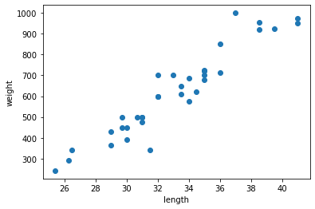
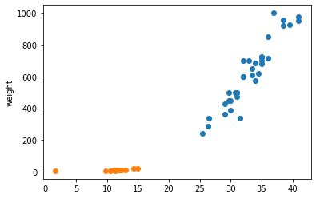
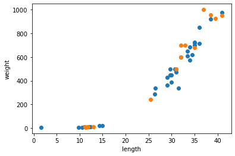
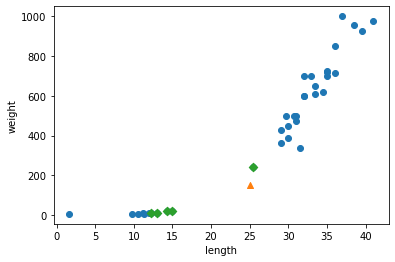
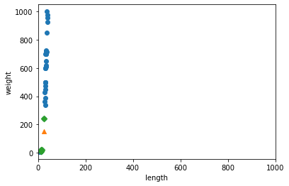
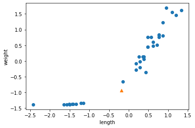
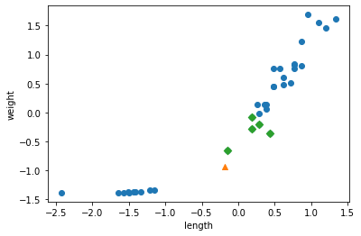

## 1강 나의 첫 머신러닝

* 클래스 
* 분류 
* 이진분류

### 도미와 빙어 데이터


```python
brem_length = [25.4,26.3,26.5,29.0,29.0,29.7,29.7,30.0,30.0,30.7,31.0,31.0,31.0,31.5,32.0,32.0,32.0,33.0,33.5,33.5,34.0,34.0,34.5,35.0,35.0,35.0,35.0,36.0,36.0,37.0,38.5,38.5,39.5,41.0,41.0]
brem_weight=[242.0,290.0,340.0,363.0,430.0,450.0,500.0,390.0,450.0,500.0,475.0,500.0,500.0,340.0,600.0,600.0,700.0,700.0,610.0,650.0,575.0,685.0,620.0,680.0,700.0,725.0,720.0,714.0,850.0,1000.0,920.0,955.0,925.0,975.0,950.0]
```


```python
print(len(brem_length))
print(len(brem_weight))
```

    35
    35
    


```python
import matplotlib.pyplot as plt

plt.scatter(brem_length,brem_weight)
plt.xlabel('length')
plt.ylabel('weight')
plt.show()
```


    

    


```python
smelt_length=[9.8,10.5,1.6,11.0,11.2,11.3,11.8,11.8,12.0,12.2,12.4,13.0,14.3,15.0]
smelt_weight=[6.7,7.5,7.0,9.7,9.8,8.7,10.0,9.9,9.8,12.2,13.4,12.2,19.7,19.9]
plt.scatter(brem_length,brem_weight)
plt.scatter(smelt_length,smelt_weight)
plt.ylabel('length')
plt.ylabel('weight')
plt.show()
```


    

    


#### 도미와 빙어 합치기 


```python
length = brem_length+smelt_length
weight = brem_weight+smelt_weight
```

#### 리스트 내포


```python
fish_data = [[l,w] for l,w in zip(length,weight)]
print(fish_data)
```

    [[25.4, 242.0], [26.3, 290.0], [26.5, 340.0], [29.0, 363.0], [29.0, 430.0], [29.7, 450.0], [29.7, 500.0], [30.0, 390.0], [30.0, 450.0], [30.7, 500.0], [31.0, 475.0], [31.0, 500.0], [31.0, 500.0], [31.5, 340.0], [32.0, 600.0], [32.0, 600.0], [32.0, 700.0], [33.0, 700.0], [33.5, 610.0], [33.5, 650.0], [34.0, 575.0], [34.0, 685.0], [34.5, 620.0], [35.0, 680.0], [35.0, 700.0], [35.0, 725.0], [35.0, 720.0], [36.0, 714.0], [36.0, 850.0], [37.0, 1000.0], [38.5, 920.0], [38.5, 955.0], [39.5, 925.0], [41.0, 975.0], [41.0, 950.0], [9.8, 6.7], [10.5, 7.5], [1.6, 7.0], [11.0, 9.7], [11.2, 9.8], [11.3, 8.7], [11.8, 10.0], [11.8, 9.9], [12.0, 9.8], [12.2, 12.2], [12.4, 13.4], [13.0, 12.2], [14.3, 19.7], [15.0, 19.9]]
    

#### 정답준비

* 정답을 도미 기준으로 1 빙어 0으로 정답 데이터 생성


```python
fish_target = [1]*35 + [0]*14
print(fish_target)
```

    [1, 1, 1, 1, 1, 1, 1, 1, 1, 1, 1, 1, 1, 1, 1, 1, 1, 1, 1, 1, 1, 1, 1, 1, 1, 1, 1, 1, 1, 1, 1, 1, 1, 1, 1, 0, 0, 0, 0, 0, 0, 0, 0, 0, 0, 0, 0, 0, 0]
    

### k최근접 이웃 알고리즘


```python
from sklearn.neighbors import KNeighborsClassifier
kn = KNeighborsClassifier()
kn.fit(fish_data,fish_target)
kn.score(fish_data,fish_target) #0-1 사이의 값 출력으로 1이면 100퍼센트 정확도 달성
```


    1.0


```python
### 새로운 생선 예측 
kn.predict([[30,600]]) #샘플 데이터 넣을 때에도 2차원으로 넣어줘야함 
```


    array([1])


```python
kn49 =KNeighborsClassifier(n_neighbors=49)#매개변수 설정

kn49.fit(fish_data,fish_target)
kn49.score(fish_data,fish_target)
```


    0.7142857142857143


* 샘플 데이터 중 49개의 데이터 확인 후에 분류하는 모형을 설정하였고,  
  이렇게 될 경우 무조건도미가 나올 수 밖에 없음 
  * 도미데이터 : 35  / 빙어데이터: 14    
  
--> 모든 데이터 군집으로 설정 시 더 데이터로 설정됨


```python
print(35/49) 
```

    0.7142857142857143
    

* 49개 중 도미만 맞추기 때문에 위와 같은 결과 확인

## 2강 데이터 다루기

### 훈련세트와 테스트세트


```python
#35개의 데이터 훈련데이터로 생성
train_input = fish_data[:35]
train_target = fish_target[:35]

#14개의 데이터 훈련데이터로 생성
test_input = fish_data[35:]
test_target = fish_target[35:]
```

### 테스트 세트에서 평가하기


```python
from sklearn.neighbors import KNeighborsClassifier

kn = KNeighborsClassifier()
kn = kn.fit(train_input,train_target)

kn.score(test_input,test_target)
```


    0.0


* 데이터 훈련과 테스트로 나눠서 실시한 결과 하나도 맞히지 못한 것을 확인할 수 있음  
  --> 위의 데이터 생성시 순서대로 35개는 도미데이터 14개는 빙어 데이터로   
    훈련 데이터에 있는 것이 테스트 데이터에 없을 수 있고 반대도 마찬가지임 

#### 넘파이 사용하기


```python
import numpy as np

input_arr = np.array(fish_data)
target_arr = np.array(fish_target)

#fish_data = np.column_stack((fish_length,fish_weight))

print(input_arr)
print(target_arr)
```

    [[  25.4  242. ]
     [  26.3  290. ]
     [  26.5  340. ]
     [  29.   363. ]
     [  29.   430. ]
     [  29.7  450. ]
     [  29.7  500. ]
     [  30.   390. ]
     [  30.   450. ]
     [  30.7  500. ]
     [  31.   475. ]
     [  31.   500. ]
     [  31.   500. ]
     [  31.5  340. ]
     [  32.   600. ]
     [  32.   600. ]
     [  32.   700. ]
     [  33.   700. ]
     [  33.5  610. ]
     [  33.5  650. ]
     [  34.   575. ]
     [  34.   685. ]
     [  34.5  620. ]
     [  35.   680. ]
     [  35.   700. ]
     [  35.   725. ]
     [  35.   720. ]
     [  36.   714. ]
     [  36.   850. ]
     [  37.  1000. ]
     [  38.5  920. ]
     [  38.5  955. ]
     [  39.5  925. ]
     [  41.   975. ]
     [  41.   950. ]
     [   9.8    6.7]
     [  10.5    7.5]
     [   1.6    7. ]
     [  11.     9.7]
     [  11.2    9.8]
     [  11.3    8.7]
     [  11.8   10. ]
     [  11.8    9.9]
     [  12.     9.8]
     [  12.2   12.2]
     [  12.4   13.4]
     [  13.    12.2]
     [  14.3   19.7]
     [  15.    19.9]]
    [1 1 1 1 1 1 1 1 1 1 1 1 1 1 1 1 1 1 1 1 1 1 1 1 1 1 1 1 1 1 1 1 1 1 1 0 0
     0 0 0 0 0 0 0 0 0 0 0 0]
    

#### 넘파이로 데이터 준비 


```python
fish_data = np.column_stack((length,weight))
fish_target = np.concatenate((np.ones(35),np.zeros(14)))
```

#### 데이터 섞기


```python
index = np.arange(49)
np.random.shuffle(index)
```


```python
train_input = input_arr[index[:35]]
train_target = target_arr[index[:35]]

test_input = input_arr[index[35:]]
test_target = target_arr[index[35:]]
```

### 데이터 나누고 확인하기


```python
import matplotlib.pyplot as plt

plt.scatter(train_input[:,0],train_input[:,1])
plt.scatter(test_input[:,0],test_input[:,1])
plt.xlabel('length')
plt.ylabel('weight')
plt.show()
```


    

    


```python
kn = kn.fit(train_input,train_target)

kn.score(test_input,test_target)
```


    1.0


### 데이터 전처리


```python
fish_target = np.concatenate((np.ones(35),np.zeros(14)))
```


```python
fish_data
#fish_target
```


    array([[  25.4,  242. ],
           [  26.3,  290. ],
           [  26.5,  340. ],
           [  29. ,  363. ],
           [  29. ,  430. ],
           [  29.7,  450. ],
           [  29.7,  500. ],
           [  30. ,  390. ],
           [  30. ,  450. ],
           [  30.7,  500. ],
           [  31. ,  475. ],
           [  31. ,  500. ],
           [  31. ,  500. ],
           [  31.5,  340. ],
           [  32. ,  600. ],
           [  32. ,  600. ],
           [  32. ,  700. ],
           [  33. ,  700. ],
           [  33.5,  610. ],
           [  33.5,  650. ],
           [  34. ,  575. ],
           [  34. ,  685. ],
           [  34.5,  620. ],
           [  35. ,  680. ],
           [  35. ,  700. ],
           [  35. ,  725. ],
           [  35. ,  720. ],
           [  36. ,  714. ],
           [  36. ,  850. ],
           [  37. , 1000. ],
           [  38.5,  920. ],
           [  38.5,  955. ],
           [  39.5,  925. ],
           [  41. ,  975. ],
           [  41. ,  950. ],
           [   9.8,    6.7],
           [  10.5,    7.5],
           [   1.6,    7. ],
           [  11. ,    9.7],
           [  11.2,    9.8],
           [  11.3,    8.7],
           [  11.8,   10. ],
           [  11.8,    9.9],
           [  12. ,    9.8],
           [  12.2,   12.2],
           [  12.4,   13.4],
           [  13. ,   12.2],
           [  14.3,   19.7],
           [  15. ,   19.9]])


#### 사이킷런으로 데이터 나누기


```python
from sklearn.model_selection import train_test_split

train_input,test_input,train_target,test_target = train_test_split(fish_data,fish_target,stratify=fish_target,random_state=42)
```


```python
from sklearn.neighbors import KNeighborsClassifier

kn =KNeighborsClassifier()
kn.fit(train_input,train_target)
kn.score(test_input,test_target)

```


    1.0


```python
print(kn.predict([[25,150]]))
```

    [0.]
    

* 아래의 그래프를 보면 눈으로 확인했을 때 도미에 가까워 보이지만 위의 결과 predict를 보면 빙어에 가깝다고 나와있음


```python
distances,indexes = kn.kneighbors([[25,150]])

plt.scatter(train_input[:,0],train_input[:,1])
plt.scatter(25,150,marker='^')
plt.scatter(train_input[indexes,0],train_input[indexes,1],marker='D')
plt.xlabel('length')
plt.ylabel('weight')
plt.show()
```


    

    


x는 0 -40 사이 y는 0 - 1000 사이로 스케일 사이즈가 맞지 않음  
따라서, 결과가 빙어로 나옴


```python
distances,indexes = kn.kneighbors([[25,150]])

plt.scatter(train_input[:,0],train_input[:,1])
plt.scatter(25,150,marker='^')
plt.scatter(train_input[indexes,0],train_input[indexes,1],marker='D')
plt.xlim((0,1000)) #x의 범위축 설정
plt.xlabel('length')
plt.ylabel('weight')
plt.show()
```


    

    


* x축 범위를 바꿔서 확인(스케일링)한 것을 보면 빙어에 가까운 것을 확인할 수 있음

#### 기준 맞추기 
* 표준점수로 바꾸기


```python
mean = np.mean(train_input,axis=0)
std=np.std(train_input,axis=0)

print(mean,std)
```

    [ 26.99166667 454.09722222] [ 10.4705241  323.29893931]
    


```python
train_scaled = (train_input - mean)/ std
```


```python
new = ([25,150]-mean) /std

plt.scatter(train_scaled[:,0],train_scaled[:,1])
plt.scatter(new[0],new[1],marker='^')
plt.xlabel('length')
plt.ylabel('weight')
plt.show()
```


    

    


* 새로운 데이터 역시 스케일링해서 결과 확인해야함


```python
kn.fit(train_scaled,train_target)

test_scaled = (test_input - mean / std)
kn.score(test_scaled,test_target)
```


    0.6923076923076923


```python
print(kn.predict([new]))
```

    [1.]
    


```python
distances,indexes = kn.kneighbors([new])

plt.scatter(train_scaled[:,0],train_scaled[:,1])
plt.scatter(new[0],new[1],marker='^')
plt.scatter(train_scaled[indexes,0],train_scaled[indexes,1],marker='D')
plt.xlabel('length')
plt.ylabel('weight')
plt.show()
```


    

    


### 회귀모델 훈련
 - 강의에선 농어데이터 사용했지만 데이터 없는 관계로 기존의 데이터 사용


```python
from sklearn.neighbors import KNeighborsRegressor

knr=KNeighborsRegressor()
knr.fit(train_input,train_target)

knr.score(test_input,test_target)
```


    1.0


```python
from sklearn.metrics import mean_absolute_error #평균 절대값 오차 

test_prediction = knr.predict(test_input)
mae = mean_absolute_error(test_target,test_prediction) #오차 확인
print(mae)  #오차 출력 - 현재 데이터로는 위에서도 100퍼센트의 확률로 정답을 맞췄기 때문에 
            #            실제값과 예측값의 오차가 없는 것으로 나옴
```

    0.0
    


```python
knr.score(train_input,train_target)
```


    1.0


```python
knr.score(test_input,test_target)
```


    1.0


### 과대적합 과소적합
* 이웃의 개수 ▽ 과대적합
* 이웃의 개수 △ 과소적합


```python
knr.n_neighbors =3 
knr.fit(train_input,train_target)

print(knr.score(train_input,train_target))

print(knr.score(test_input,test_target))
```

    1.0
    1.0
    

현재 데이터로는 정확한 예측을 한다고 되어 있기 때문에 군집수를 줄이고 늘리는 것은 의미가 없음  
보통의 경우엔 이웃의 수를 줄이면 과대적합 가능성이 높고 수를 늘리면 과대적합의 가능성이 큼

n_neighbors =3 과 같은 것은 하이퍼파라미터라고 부르며 매개변수  
이것을 통해 더 정확한 예측 모델을 찾아나가는 것으로    
사용자의 판단에 의해서 선택해야하지만 가장 적절한 것을 찾아주는 것이 있음
