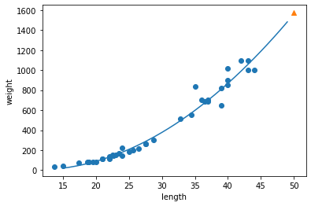
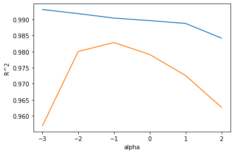
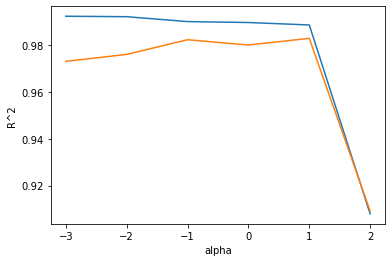

## 선형회귀


```python
import numpy as np

perch_length = np.array(
    [8.4, 13.7, 15.0, 16.2, 17.4, 18.0, 18.7, 19.0, 19.6, 20.0, 
     21.0, 21.0, 21.0, 21.3, 22.0, 22.0, 22.0, 22.0, 22.0, 22.5, 
     22.5, 22.7, 23.0, 23.5, 24.0, 24.0, 24.6, 25.0, 25.6, 26.5, 
     27.3, 27.5, 27.5, 27.5, 28.0, 28.7, 30.0, 32.8, 34.5, 35.0, 
     36.5, 36.0, 37.0, 37.0, 39.0, 39.0, 39.0, 40.0, 40.0, 40.0, 
     40.0, 42.0, 43.0, 43.0, 43.5, 44.0]
     )
perch_weight = np.array(
    [5.9, 32.0, 40.0, 51.5, 70.0, 100.0, 78.0, 80.0, 85.0, 85.0, 
     110.0, 115.0, 125.0, 130.0, 120.0, 120.0, 130.0, 135.0, 110.0, 
     130.0, 150.0, 145.0, 150.0, 170.0, 225.0, 145.0, 188.0, 180.0, 
     197.0, 218.0, 300.0, 260.0, 265.0, 250.0, 250.0, 300.0, 320.0, 
     514.0, 556.0, 840.0, 685.0, 700.0, 700.0, 690.0, 900.0, 650.0, 
     820.0, 850.0, 900.0, 1015.0, 820.0, 1100.0, 1000.0, 1100.0, 
     1000.0, 1000.0]
     )
```

### k최근접 이웃의 한계


```python
from sklearn.model_selection import train_test_split

train_input,test_input,train_target,test_target = train_test_split(perch_length,perch_weight,random_state=42)
train_input = train_input.reshape(-1,1)
test_input=test_input.reshape(-1,1)
```


```python
from sklearn.neighbors import KNeighborsRegressor

knr = KNeighborsRegressor(n_neighbors=3)
knr.fit(train_input, train_target)
```


    KNeighborsRegressor(n_neighbors=3)


```python
#최근접 이웃으로 예측한 농어 50cm의 무게 

print(knr.predict([[50]]))
```

    [1033.33333333]
    


```python
import matplotlib.pyplot as plt
```


```python
# 50cm 농어의 이웃을 구하기 
distances, indexes = knr.kneighbors([[50]])

plt.scatter(train_input, train_target)
#훈련세트의 이웃 세트만 다시 표시 
plt.scatter(train_input[indexes], train_target[indexes], marker='D')
plt.scatter(50, 1033, marker='^')
plt.xlabel('length')
plt.ylabel('weight')
plt.show()
```


    

    


훈련세트의 범위 밖이면 예상하기 어려워짐


```python
print(np.mean(train_target[indexes]))
```

    1033.3333333333333
    


```python
print(knr.predict([[100]]))
```

    [1033.33333333]
    

### 선형회귀


```python
from sklearn.linear_model import LinearRegression

lr =  LinearRegression()
lr.fit(train_input, train_target)

#선형회귀로 예측한 50cm 농어의 무게
print(lr.predict([[50]]))
```

    [1241.83860323]
    


```python
#기울기와 상수 확인

print(lr.coef_, lr.intercept_)
```

    [39.01714496] -709.0186449535477
    

--> y = 39.0171x + -709.01864의 일차식 생성


```python
plt.scatter(train_input,train_target)

# 15에서 50까지 1차 방정식 그리기
plt.plot([15, 50], [15*lr.coef_+lr.intercept_, 50*lr.coef_+lr.intercept_])

# 50cm 농어 데이터
plt.scatter(50, 1241.8, marker='^')

plt.xlabel('length')
plt.ylabel('weight')
plt.show()
```


    

    


```python
print(lr.score(train_input, train_target))
print(lr.score(test_input, test_target))
```

    0.939846333997604
    0.8247503123313558
    

### 다항회귀
일차방정식이었던 농어 회귀식을 2차방정식으로 생성
* np.column_stack을 사용하여 제곱한 변수와 기존의 변수 열로 붙임


```python
train_poly = np.column_stack((train_input**2,train_input))
test_poly = np.column_stack((test_input**2,test_input))  
```


```python
print(train_poly.shape, test_poly.shape)
```

    (42, 2) (14, 2)
    


```python
lr = LinearRegression()
lr.fit(train_poly, train_target)

print(lr.predict([[50**2, 50]]))#50농어의 무게 예측값
print(lr.coef_, lr.intercept_)
```

    [1573.98423528]
    [  1.01433211 -21.55792498] 116.05021078278259
    

--> y = 1.014.211x^2 - 21.5579x+116.0502의 식이 생성됨 


```python
point = np.arange(15, 50)

# 훈련 세트의 산점도를 그립니다
plt.scatter(train_input, train_target)

# 15에서 49까지 2차 방정식 그래프를 그립니다
plt.plot(point, 1.01*point**2 - 21.6*point + 116.05)

# 50cm 농어 데이터
plt.scatter([50], [1574], marker='^')

plt.xlabel('length')
plt.ylabel('weight')
plt.show()
```


    

    


```python
print(lr.score(train_poly, train_target))
print(lr.score(test_poly, test_target))
```

    0.9706807451768623
    0.9775935108325121
    

## 특성공학과 규제


```python
import pandas as pd
```


```python
df = pd.read_csv('https://bit.ly/perch_csv_data')
perch_full = df.to_numpy()
print(perch_full)
```

    [[ 8.4   2.11  1.41]
     [13.7   3.53  2.  ]
     [15.    3.82  2.43]
     [16.2   4.59  2.63]
     [17.4   4.59  2.94]
     [18.    5.22  3.32]
     [18.7   5.2   3.12]
     [19.    5.64  3.05]
     [19.6   5.14  3.04]
     [20.    5.08  2.77]
     [21.    5.69  3.56]
     [21.    5.92  3.31]
     [21.    5.69  3.67]
     [21.3   6.38  3.53]
     [22.    6.11  3.41]
     [22.    5.64  3.52]
     [22.    6.11  3.52]
     [22.    5.88  3.52]
     [22.    5.52  4.  ]
     [22.5   5.86  3.62]
     [22.5   6.79  3.62]
     [22.7   5.95  3.63]
     [23.    5.22  3.63]
     [23.5   6.28  3.72]
     [24.    7.29  3.72]
     [24.    6.38  3.82]
     [24.6   6.73  4.17]
     [25.    6.44  3.68]
     [25.6   6.56  4.24]
     [26.5   7.17  4.14]
     [27.3   8.32  5.14]
     [27.5   7.17  4.34]
     [27.5   7.05  4.34]
     [27.5   7.28  4.57]
     [28.    7.82  4.2 ]
     [28.7   7.59  4.64]
     [30.    7.62  4.77]
     [32.8  10.03  6.02]
     [34.5  10.26  6.39]
     [35.   11.49  7.8 ]
     [36.5  10.88  6.86]
     [36.   10.61  6.74]
     [37.   10.84  6.26]
     [37.   10.57  6.37]
     [39.   11.14  7.49]
     [39.   11.14  6.  ]
     [39.   12.43  7.35]
     [40.   11.93  7.11]
     [40.   11.73  7.22]
     [40.   12.38  7.46]
     [40.   11.14  6.63]
     [42.   12.8   6.87]
     [43.   11.93  7.28]
     [43.   12.51  7.42]
     [43.5  12.6   8.14]
     [44.   12.49  7.6 ]]
    


```python
import numpy as np

perch_weight = np.array(
    [5.9, 32.0, 40.0, 51.5, 70.0, 100.0, 78.0, 80.0, 85.0, 85.0, 
     110.0, 115.0, 125.0, 130.0, 120.0, 120.0, 130.0, 135.0, 110.0, 
     130.0, 150.0, 145.0, 150.0, 170.0, 225.0, 145.0, 188.0, 180.0, 
     197.0, 218.0, 300.0, 260.0, 265.0, 250.0, 250.0, 300.0, 320.0, 
     514.0, 556.0, 840.0, 685.0, 700.0, 700.0, 690.0, 900.0, 650.0, 
     820.0, 850.0, 900.0, 1015.0, 820.0, 1100.0, 1000.0, 1100.0, 
     1000.0, 1000.0]
     )
```


```python
from sklearn.model_selection import train_test_split

train_input, test_input, train_target, test_target = train_test_split(perch_full, perch_weight, random_state=42)
```

### 다항특성 만들기


```python
from sklearn.preprocessing import PolynomialFeatures
```


```python
poly = PolynomialFeatures()

#degee  = 2 기본값으로 제곱항으로 만들어줌 
poly.fit([[2, 3]])
print(poly.transform([[2, 3]]))
```

    [[1. 2. 3. 4. 6. 9.]]
    

* 변환기 (Transformer)
    * PolynominalFeatures  
* 추정기 (Estimator)
    * LinearRegrssion
    * KNN 등
    추정기는 fit predict score와 같은 메서드 사용 

### LinearRegression


```python
poly = PolynomialFeatures(include_bias=False) #1 추가하지 않도록 설정 
poly.fit([[2, 3]])
print(poly.transform([[2, 3]]))
```

    [[2. 3. 4. 6. 9.]]
    


```python
print(train_poly.shape)
```

    (42, 2)
    


```python
poly.get_feature_names()
```


    ['x0', 'x1', 'x0^2', 'x0 x1', 'x1^2']


```python
from sklearn.linear_model import LinearRegression

lr = LinearRegression()
lr.fit(train_poly, train_target)
print(lr.score(train_poly, train_target))
```

    0.9706807451768623
    


```python
print(lr.score(test_poly, test_target))
```

    0.9775935108325121
    

### 더 많은 특성 생성


```python
poly = PolynomialFeatures(degree=5, include_bias=False)

poly.fit(train_input)
train_poly = poly.transform(train_input)
test_poly = poly.transform(test_input)
```

특성 55개 생성된 것을 확인할 수 있음


```python
print(train_poly.shape)
```

    (42, 55)
    


```python
lr.fit(train_poly, train_target)
print(lr.score(train_poly, train_target))
```

    0.9999999999938143
    


```python
print(lr.score(test_poly, test_target))
```

    -144.40744532797535
    

훈련세트 42개에 비해서 55개의 너무 많은 특성을 생성하였고,  
이로 인해 학습만 너무 많이 되어 과대적합이 일어날 수 밖에 없음

## 규제 
가중치(기울기)값을 작게 만드는 역할로 과대적합된 모델을 완화하는 역할   
* Lasso
* Lidge

LinearRegrssion은 스케일하지 않음.   
사이킷런등에서 사용하는 모델들은 특성에 영향을 받지 않는  
알고리즘을 사용하기 때문에 따로 하지 않아도 됨  
  
그러나 규제 즉. 모델을 완화하기 위해서는 스케일을 실시해야 함


```python
from sklearn.preprocessing import StandardScaler

ss = StandardScaler()
ss.fit(train_poly)

train_scaled = ss.transform(train_poly)
test_scaled = ss.transform(test_poly)
```

## Lidge
가중치를 제곱하는 것으로 l2규제라고도 하는데 이를 사용하여 완화 


```python
from sklearn.linear_model import Ridge

ridge = Ridge() #alpha라는 매개변수 사용 기본값은 1 / 숫자 클수록 규제 강도 커짐
ridge.fit(train_scaled, train_target)
print(ridge.score(train_scaled, train_target))
```

    0.9896101671037343
    


```python
print(ridge.score(test_scaled, test_target))
```

    0.9790693977615386
    

### 적절한 규제 강도 찾기


```python
import matplotlib.pyplot as plt

#결과 저장할 훈련,테스트 리스트 생성
train_score = []
test_score = []
```


```python
alpha_list = [0.001, 0.01, 0.1, 1, 10, 100]

for alpha in alpha_list:
    #릿지 생성
    ridge = Ridge(alpha=alpha)
    ridge.fit(train_scaled, train_target)
    # 훈련 점수와 테스트 점수를 저장
    train_score.append(ridge.score(train_scaled, train_target))
    test_score.append(ridge.score(test_scaled, test_target))
```


```python
plt.plot(np.log10(alpha_list), train_score)
plt.plot(np.log10(alpha_list), test_score)
plt.xlabel('alpha')
plt.ylabel('R^2')
plt.show()
```


    

    


알파값이 -1일때 가장 성능이 좋은 것으로 확인  
알파값이 커지면 훈련이 쎄지기 때문에  
훈련값 테스트값 둘 다 작아지는 것을 확인할 수 있음


```python
ridge = Ridge(alpha=0.1) #알파값 설정해서 릿지 수행
ridge.fit(train_scaled, train_target)

print(ridge.score(train_scaled, train_target))
print(ridge.score(test_scaled, test_target))
```

    0.9903815817570368
    0.9827976465386896
    

## Lasso
가중치의 절댓값을 규제(=L1)에 사용  
특성을 0으로 만드는 경향이 있어 릿지를 더 많이 사용


```python
from sklearn.linear_model import Lasso

lasso = Lasso()
lasso.fit(train_scaled, train_target)
print(lasso.score(train_scaled, train_target))
```

    0.989789897208096
    


```python
print(lasso.score(test_scaled, test_target))
```

    0.9800593698421884
    


```python
train_score = []
test_score = []

alpha_list = [0.001, 0.01, 0.1, 1, 10, 100]
for alpha in alpha_list:
    lasso = Lasso(alpha=alpha, max_iter=10000)
    lasso.fit(train_scaled, train_target)
    train_score.append(lasso.score(train_scaled, train_target))
    test_score.append(lasso.score(test_scaled, test_target))
```

    C:\Users\juhee\jh\lib\site-packages\sklearn\linear_model\_coordinate_descent.py:530: ConvergenceWarning: Objective did not converge. You might want to increase the number of iterations. Duality gap: 18778.697957792032, tolerance: 518.2793833333334
      model = cd_fast.enet_coordinate_descent(
    C:\Users\juhee\jh\lib\site-packages\sklearn\linear_model\_coordinate_descent.py:530: ConvergenceWarning: Objective did not converge. You might want to increase the number of iterations. Duality gap: 12972.821345401393, tolerance: 518.2793833333334
      model = cd_fast.enet_coordinate_descent(
    


```python
plt.plot(np.log10(alpha_list), train_score)
plt.plot(np.log10(alpha_list), test_score)
plt.xlabel('alpha')
plt.ylabel('R^2')
plt.show()
```


    

    


```python
lasso = Lasso(alpha=10)
lasso.fit(train_scaled, train_target)

print(lasso.score(train_scaled, train_target))
print(lasso.score(test_scaled, test_target))
```

    0.9888067471131867
    0.9824470598706695
    

55개의 특성을 생성하였지만 라쏘는 40개의 특성만 사용한 것을 확인할 수 있음


```python
print(np.sum(lasso.coef_ == 0))
```

    40
    
