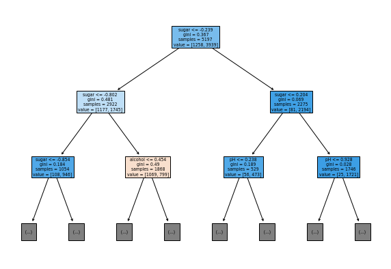

## 결정트리


```python
import pandas as pd

wine = pd.read_csv('https://bit.ly/wine_csv_data')
```


```python
wine.info()
```

    <class 'pandas.core.frame.DataFrame'>
    RangeIndex: 6497 entries, 0 to 6496
    Data columns (total 4 columns):
     #   Column   Non-Null Count  Dtype  
    ---  ------   --------------  -----  
     0   alcohol  6497 non-null   float64
     1   sugar    6497 non-null   float64
     2   pH       6497 non-null   float64
     3   class    6497 non-null   float64
    dtypes: float64(4)
    memory usage: 203.2 KB
    

현재 데이터 상태보면 null이 없지만 만약 있다면 평균 / 중간값 / 행 삭제의 방법으로 null을 대체해서 사용함


```python
wine.describe()
```


<div>
<style scoped>
    .dataframe tbody tr th:only-of-type {
        vertical-align: middle;
    }

    .dataframe tbody tr th {
        vertical-align: top;
    }

    .dataframe thead th {
        text-align: right;
    }
</style>
<table border="1" class="dataframe">
  <thead>
    <tr style="text-align: right;">
      <th></th>
      <th>alcohol</th>
      <th>sugar</th>
      <th>pH</th>
      <th>class</th>
    </tr>
  </thead>
  <tbody>
    <tr>
      <th>count</th>
      <td>6497.000000</td>
      <td>6497.000000</td>
      <td>6497.000000</td>
      <td>6497.000000</td>
    </tr>
    <tr>
      <th>mean</th>
      <td>10.491801</td>
      <td>5.443235</td>
      <td>3.218501</td>
      <td>0.753886</td>
    </tr>
    <tr>
      <th>std</th>
      <td>1.192712</td>
      <td>4.757804</td>
      <td>0.160787</td>
      <td>0.430779</td>
    </tr>
    <tr>
      <th>min</th>
      <td>8.000000</td>
      <td>0.600000</td>
      <td>2.720000</td>
      <td>0.000000</td>
    </tr>
    <tr>
      <th>25%</th>
      <td>9.500000</td>
      <td>1.800000</td>
      <td>3.110000</td>
      <td>1.000000</td>
    </tr>
    <tr>
      <th>50%</th>
      <td>10.300000</td>
      <td>3.000000</td>
      <td>3.210000</td>
      <td>1.000000</td>
    </tr>
    <tr>
      <th>75%</th>
      <td>11.300000</td>
      <td>8.100000</td>
      <td>3.320000</td>
      <td>1.000000</td>
    </tr>
    <tr>
      <th>max</th>
      <td>14.900000</td>
      <td>65.800000</td>
      <td>4.010000</td>
      <td>1.000000</td>
    </tr>
  </tbody>
</table>
</div>


```python
data = wine[['alcohol', 'sugar', 'pH']].to_numpy()
target = wine['class'].to_numpy()
```


```python
from sklearn.model_selection import train_test_split

train_input, test_input, train_target, test_target = train_test_split(
    data, target, test_size=0.2, random_state=42)
```

### 정규화 


```python
from sklearn.preprocessing import StandardScaler

ss = StandardScaler()
ss.fit(train_input)

train_scaled = ss.transform(train_input)
test_scaled = ss.transform(test_input)
```

### 로지스틱회귀로 분류


```python
from sklearn.linear_model import LogisticRegression

lr = LogisticRegression()
lr.fit(train_scaled, train_target)

print(lr.score(train_scaled, train_target))
print(lr.score(test_scaled, test_target))
```

    0.7808350971714451
    0.7776923076923077
    


```python
print(lr.coef_, lr.intercept_)
```

    [[ 0.51270274  1.6733911  -0.68767781]] [1.81777902]
    

--> 알코올도수와 당도가 높을 경우에는 화이트 화인,  
PH가 높을수록 레드와인으로 분류하는 것으로 볼 수 있다  
  
로지스틱으로 분류할시 한눈에 알아보기 어려워 아래와 같은 결정트리를 사용해서  
화이트와인과 레드와인으로 분류를 실시할 수 있음

### 결정트리 


```python
from sklearn.tree import DecisionTreeClassifier

dt = DecisionTreeClassifier(random_state=42)
dt.fit(train_scaled,train_target)

print(dt.score(train_scaled, train_target))
print(dt.score(test_scaled, test_target))
```

    0.996921300750433
    0.8592307692307692
    


```python
import matplotlib.pyplot as plt
from sklearn.tree import plot_tree

plt.figure(figsize=(10,7))
plot_tree(dt)
plt.show()
```


    

    


```python
plt.figure(figsize=(10,7))
plot_tree(dt, max_depth=2, filled=True, feature_names=['alcohol', 'sugar', 'pH'])
plt.show()
```


    

    


#### 지니불순도

의사결정나무에선 구분해주는 분류기준이 중요한데 어떤 기준으로 분류했을 때 동일한 객체들로만 잘 모아지게 하는지 분류하는 것이 중요 이때, 기준을 지니라고 함    
불순도를 사용하면 현재 집단에서 얼마만큼의 다른 객체들이 섞여 있는지 확인하고 불순도가 낮은 쪽으로 가지 형성 

지니불순도 = 1 - (음성클래스비율^2 + 양성클래스비율^2)
