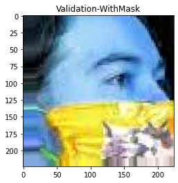
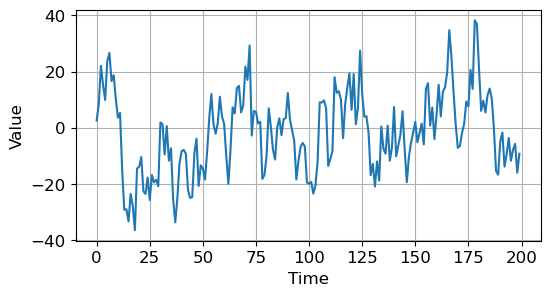
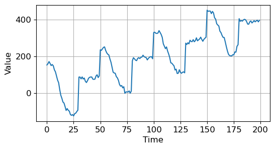
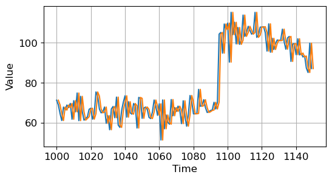

### 필요한 모듈 불러오기 및 함수 생성


```python
import numpy as np
import matplotlib.pyplot as plt
import tensorflow as tf
from tensorflow import keras

plt.style.use('default')
plt.rcParams['figure.figsize'] = (6, 3)
plt.rcParams['font.size'] = 12

def plot_series(time, series, format="-", start=0, end=None, label=None):
    plt.plot(time[start:end], series[start:end], format, label=label)
    plt.xlabel("Time")
    plt.ylabel("Value")
    if label:
        plt.legend(fontsize=14)
    plt.grid(True)
```

* plot_series()  
  시간, 시계열 데이터(series)를 입력받아 matplotlib으로 나타내는 함수
  * 시계열 데이터 : 관측치가 시간적 순서를 가진 데이터

### 경향성을 갖는 시계열 데이터 


```python
def trend(time,slope=0):
    return slope * time

time = np.arange(4 * 365 + 1)
series = trend(time,slope=0.1)

plot_series(time,series)
plt.show()
```


* trend() 경향성을 갖는 시계열 데이터 반환  
slope에 따라서 시간에 따라 양 경향성, 음 경향성 가질 수 있음

### 계절성을 갖는 시계열 데이터
* 계절성 : 특정한 기간마다 패턴 가지고 반복하는지 확인할 수 있는 특성


```python
def seasonal_pattern(season_time):
    return np.where(season_time < 0.6,
                    np.cos(season_time * 2 * np.pi),
                    1 / np.exp(3 * season_time))

def seasonality(time, period, amplitude=1, phase=0):
    season_time = ((time + phase) % period) / period
    return amplitude * seasonal_pattern(season_time)

amplitude = 40
series = seasonality(time, period=365, amplitude=amplitude)

plot_series(time, series)
plt.show()
```


### 경향성과 계절성을 모두 갖는 시계열 데이터


```python
baseline = 10
slope = 0.05
series = baseline + trend(time, slope) + seasonality(time, period=365, amplitude=amplitude)

plot_series(time, series)
plt.show()
```





### 노이즈를 갖는 시계열 데이터
* 랜덤(노이즈) :추세 계절성등으로 설명되지 않는 데이터로 이런 데이터를 가지고 예측하게 되면 예측의 오차가 커져 전처리 통해 예측에 관여하지 않도록 하는 것이 중요


```python
def white_noise(time, noise_level=1, seed=None):
    rnd = np.random.RandomState(seed)
    return rnd.rand(len(time)) * noise_level

noise_level = 5
noise = white_noise(time, noise_level, seed=42)

plot_series(time, noise)
plt.show()
```


### 경향성 계절성 노이즈 모두 갖는 시계열 데이터


```python
baseline = 10
slope = 0.05
noise_level = 5
series = baseline + trend(time, slope) + seasonality(time, period=365, amplitude=amplitude) \
        + white_noise(time, noise_level, seed=42)

plot_series(time, series)
plt.show()
```


### 자기상관성을 갖는 시계열 데이터 
* 자기상관 : 시간 또는 공간적으로 연속된 일련의 관측치들 간에 존재하는 상관관계


```python
split_time = 1000
time_train, x_train = time[:split_time], series[:split_time]
time_valid, x_valid = time[split_time:], series[split_time:]

def autocorrelation(time, amplitude, seed=None): #자기상관성 갖는 시계열 데이터 반환
    rnd = np.random.RandomState(seed)
    pi = 0.8
    ar =  rnd.randn(len(time) + 1) #임의 데이터 값 설정 
    for step in range(1, len(time) + 1):
        ar[step] += pi * ar[step - 1]       ## 이전의 값의 0.8배를 더하기
    return ar[1:] * amplitude

series = autocorrelation(time, 10, seed=42)
plot_series(time[:200], series[:200])
plt.show()
```





### 자기상관성 경향성 갖는 시계열 데이터


```python
series = autocorrelation(time, 10, seed=42) + trend(time, 2)
plot_series(time[:200], series[:200])
plt.show()
```


### 자기상관성 경향성 계절성 갖는 시계열 데이터 


```python
series = autocorrelation(time, 10, seed=42) + seasonality(time, period=50, amplitude=150) + trend(time, 2)
plot_series(time[:200], series[:200])
plt.show()
```





### 특정 시점이후로 다른 특성을 갖는 시계열 데이터


```python
series = autocorrelation(time, 10, seed=42) + seasonality(time, period=50, amplitude=150) + trend(time, 2)
series2 = autocorrelation(time, 5, seed=42) + seasonality(time, period=50, amplitude=2) + trend(time, -1) + 550
series[200:] = series2[200:]        # 자기상관 amp 10->5, 계절성 amp 150->2, 경향성 slope 2->-1 + 550
series += white_noise(time, 30)
plot_series(time[:300], series[:300])
plt.show()
```


-----------------------------------------------

## 시계열 데이터 만들기


```python
import numpy as np
import matplotlib.pyplot as plt
import tensorflow as tf
from tensorflow import keras

# 1. 기본 스타일 설정
plt.style.use('default')
plt.rcParams['figure.figsize'] = (6, 3)
plt.rcParams['font.size'] = 12


def plot_series(time, series, format="-", start=0, end=None):
    plt.plot(time[start:end], series[start:end], format)
    plt.xlabel("Time")
    plt.ylabel("Value")
    plt.grid(True)

def trend(time, slope=0):
    return slope * time

def seasonal_pattern(season_time):
    return np.where(season_time < 0.4, np.cos(season_time * 2 * np.pi), 1 / np.exp(3 * season_time))

def seasonality(time, period, amplitude=1, phase=0):
    season_time = ((time + phase) % period) / period
    return amplitude * seasonal_pattern(season_time)

def noise(time, noise_level=1, seed=None):
    rnd = np.random.RandomState(seed)
    return rnd.randn(len(time)) * noise_level

time = np.arange(4 * 365 + 1, dtype="float32")
baseline = 10
series = trend(time, 0.1)
baseline = 10
amplitude = 40
slope = 0.05
noise_level = 5

# Create the series
series = baseline + trend(time, slope) + seasonality(time, period=365, amplitude=amplitude)

# Update with noise
series += noise(time, noise_level, seed=42)

plot_series(time, series)
plt.show()
```


## 훈련용 데이터, 검증용 데이터 분리


```python
split_time = 1000
time_train = time[:split_time] #9999번까지의 데이터 
x_train = series[:split_time]

time_valid = time[split_time:] #10000만부터의 데이터 
x_valid = series[split_time:]

plot_series(time_train, x_train)
plt.show()

plot_series(time_valid, x_valid)
plt.show()
```


## Naive Forecast
이전의 데이터를 다음 값으로 예측하는 시계열 데이터


```python
naive_forecast = series[split_time - 1: -1]
plot_series(time_valid, x_valid)
plot_series(time_valid, naive_forecast)
```


```python
plot_series(time_valid, x_valid, start=0, end=150)
plot_series(time_valid, naive_forecast, start=1, end=151)
```





### 두 시계열 데이터 간의 오차 정량화 


```python
print(keras.metrics.mean_squared_error(x_valid, naive_forecast).numpy())
print(keras.metrics.mean_absolute_error(x_valid, naive_forecast).numpy())
```

    61.827538
    5.9379086
    

## 지난 30개의 평균값으로 예측


```python
def moving_average_forecast(series, window_size):
    forecast = []
    for time in range(len(series) - window_size):
        forecast.append(series[time: time + window_size].mean())
    return np.array(forecast)

moving_avg = moving_average_forecast(series, 30)[split_time - 30:]

plot_series(time_valid, x_valid)
plot_series(time_valid, moving_avg)
```


## 오차 확인 


```python
print(keras.metrics.mean_squared_error(x_valid, moving_avg).numpy())
print(keras.metrics.mean_absolute_error(x_valid, moving_avg).numpy())
```

    106.674576
    7.142419
    

-------------------------------------------------

## 날씨 데이터 

### 데이터준비


```python
import tensorflow as tf
import matplotlib as mpl
import matplotlib.pyplot as plt
import numpy as np
import os
import pandas as pd

mpl.rcParams['figure.figsize'] = (8, 6)
mpl.rcParams['axes.grid'] = False

zip_path = tf.keras.utils.get_file(
  origin='https://storage.googleapis.com/tensorflow/tf-keras-datasets/jena_climate_2009_2016.csv.zip',
  fname='jena_climate_2009_2016.csv.zip',
  extract=True)
csv_path, _ = os.path.splitext(zip_path)
```

    Downloading data from https://storage.googleapis.com/tensorflow/tf-keras-datasets/jena_climate_2009_2016.csv.zip
    13574144/13568290 [==============================] - 1s 0us/step
    

### 데이터 살펴보기


```python
df = pd.read_csv(csv_path)
print(df.head())
print(df.columns)
```

                 Date Time  p (mbar)  T (degC)  Tpot (K)  Tdew (degC)  rh (%)  \
    0  01.01.2009 00:10:00    996.52     -8.02    265.40        -8.90    93.3   
    1  01.01.2009 00:20:00    996.57     -8.41    265.01        -9.28    93.4   
    2  01.01.2009 00:30:00    996.53     -8.51    264.91        -9.31    93.9   
    3  01.01.2009 00:40:00    996.51     -8.31    265.12        -9.07    94.2   
    4  01.01.2009 00:50:00    996.51     -8.27    265.15        -9.04    94.1   
    
       VPmax (mbar)  VPact (mbar)  VPdef (mbar)  sh (g/kg)  H2OC (mmol/mol)  \
    0          3.33          3.11          0.22       1.94             3.12   
    1          3.23          3.02          0.21       1.89             3.03   
    2          3.21          3.01          0.20       1.88             3.02   
    3          3.26          3.07          0.19       1.92             3.08   
    4          3.27          3.08          0.19       1.92             3.09   
    
       rho (g/m**3)  wv (m/s)  max. wv (m/s)  wd (deg)  
    0       1307.75      1.03           1.75     152.3  
    1       1309.80      0.72           1.50     136.1  
    2       1310.24      0.19           0.63     171.6  
    3       1309.19      0.34           0.50     198.0  
    4       1309.00      0.32           0.63     214.3  
    Index(['Date Time', 'p (mbar)', 'T (degC)', 'Tpot (K)', 'Tdew (degC)',
           'rh (%)', 'VPmax (mbar)', 'VPact (mbar)', 'VPdef (mbar)', 'sh (g/kg)',
           'H2OC (mmol/mol)', 'rho (g/m**3)', 'wv (m/s)', 'max. wv (m/s)',
           'wd (deg)'],
          dtype='object')
    

### 모델 훈련을 위해 사용할 특정 시간 윈도우 데이터 얻기 위한 함수 설정


```python
def univariate_data(dataset, start_index, end_index, history_size, target_size):
    data = []
    labels = []

    start_index = start_index + history_size #과거 데이터 크기 
    if end_index is None:
        end_index = len(dataset) - target_size #얼마 동안의 미래 예측할지 의미 

    for i in range(start_index, end_index):
        indices = range(i - history_size, i)
        # Reshape data from (history_size,) to (history_size, 1)
        data.append(np.reshape(dataset[indices], (history_size, 1)))
        labels.append(dataset[i+target_size])
    return np.array(data), np.array(labels)
```

#### 훈련 데이터 설정 


```python
TRAIN_SPLIT = 300000
tf.random.set_seed(13)
```

### 온도 데이터만 추출


```python
uni_data = df['T (degC)']
uni_data.index = df['Date Time']
print(uni_data.head())
```

    Date Time
    01.01.2009 00:10:00   -8.02
    01.01.2009 00:20:00   -8.41
    01.01.2009 00:30:00   -8.51
    01.01.2009 00:40:00   -8.31
    01.01.2009 00:50:00   -8.27
    Name: T (degC), dtype: float64
    


```python
uni_data.plot(subplots=True)
plt.show()
```


### 표준화 실시 
온도 데이터에서 평균 빼고 표준편차 나눔


```python
uni_data = uni_data.values
uni_train_mean = uni_data[:TRAIN_SPLIT].mean()
uni_train_std = uni_data[:TRAIN_SPLIT].std()
uni_data = (uni_data - uni_train_mean) / uni_train_std  # Standardization

print(uni_data)
```

    [-1.99766294 -2.04281897 -2.05439744 ... -1.43494935 -1.55883897
     -1.62715193]
    

### 첫번째 예측
20개의 온도 관측치 입력하고 다음 시간 스템의 온도 예측하도록 설정


```python
univariate_past_history = 20
univariate_future_target = 0

x_train_uni, y_train_uni = univariate_data(uni_data, 0, TRAIN_SPLIT,
                                         univariate_past_history,
                                         univariate_future_target)
x_val_uni, y_val_uni = univariate_data(uni_data, TRAIN_SPLIT, None,
                                     univariate_past_history,
                                     univariate_future_target)

print('Single window of past history')
print(x_train_uni[0])
print('\n Target temperature to predict')
print(y_train_uni[0])
```

    Single window of past history
    [[-1.99766294]
     [-2.04281897]
     [-2.05439744]
     [-2.0312405 ]
     [-2.02660912]
     [-2.00113649]
     [-1.95134907]
     [-1.95134907]
     [-1.98492663]
     [-2.04513467]
     [-2.08334362]
     [-2.09723778]
     [-2.09376424]
     [-2.09144854]
     [-2.07176515]
     [-2.07176515]
     [-2.07639653]
     [-2.08913285]
     [-2.09260639]
     [-2.10418486]]
    
     Target temperature to predict
    -2.1041848598100876
    

--> univariate_data()함수가 만든 20개의 과거 온도 데이터를 통해 1개의 예측온도

### 그래프로 그려보기


```python
def create_time_steps(length):
    return list(range(-length, 0))


def show_plot(plot_data, delta, title):
    labels = ['History', 'True Future', 'Model Prediction']
    marker = ['.-', 'rx', 'go']
    time_steps = create_time_steps(plot_data[0].shape[0])
    if delta:
        future = delta
    else:
        future = 0

    plt.title(title)
    for i, x in enumerate(plot_data):
        if i:
            plt.plot(future, plot_data[i], marker[i], markersize=10, label=labels[i])
        else:
            plt.plot(time_steps, plot_data[i].flatten(), marker[i], label=labels[i])
    plt.legend()
    plt.axis('auto')
    plt.xlim([time_steps[0], (future+5)*2])
    plt.xlabel('Time-Step')
    return plt
```

#### 과거의 온도 데이터로 예측해야 할 미래의 온도 데이터 나타내기


```python
show_plot([x_train_uni[0], y_train_uni[0]], 0, 'Sample Example').show()
```


#### 과거 20개의 데이터 받아서 평균 반환하는 함수


```python
def baseline(history):
    return np.mean(history)


show_plot([x_train_uni[0], y_train_uni[0], baseline(x_train_uni[0])], 0, 'Sample Example').show()
```


--> 녹색 점은 과거 온도 데이터의 평균값을 이용해 예측한 지점을 나타내는 것인데 실제 데이터와는 꽤 차이가 있다는 것을 알 수 있음

### 순환신경망(RNN)
입력된 데이터들에 대한 정보 유지하면서 시계열 데이터 처리

* cache() 데이터셋을 메모리 파일에 보관, 따라서 두번째 iteration부터 캐시된 데이터 사용
* shuffle() 임의로 데이터 셋 섞음 buffer_size개로 이루어진 버퍼로 임의로 샘플 뽑고 뽑은 샘플 다른 샘플로 대체
* batch() 데이터셋 항목들을 하나의 배치로 묶음


```python
BATCH_SIZE = 256
BUFFER_SIZE = 10000

train_univariate = tf.data.Dataset.from_tensor_slices((x_train_uni, y_train_uni))
train_univariate = train_univariate.cache().shuffle(BUFFER_SIZE).batch(BATCH_SIZE).repeat()

val_univariate = tf.data.Dataset.from_tensor_slices((x_val_uni, y_val_uni))
val_univariate = val_univariate.batch(BATCH_SIZE).repeat()
```

### LSTM


```python
simple_lstm_model = tf.keras.models.Sequential([
    tf.keras.layers.LSTM(8, input_shape=x_train_uni.shape[-2:]),
    tf.keras.layers.Dense(1)
])

simple_lstm_model.compile(optimizer='adam', loss='mae')
```


```python
EVALUATION_INTERVAL = 200
EPOCHS = 10

simple_lstm_model.fit(train_univariate, epochs=EPOCHS,
                      steps_per_epoch=EVALUATION_INTERVAL,
                      validation_data=val_univariate, validation_steps=50)
```

    Epoch 1/10
    200/200 [==============================] - 14s 34ms/step - loss: 0.2675 - val_loss: 0.0540
    Epoch 2/10
    200/200 [==============================] - 6s 28ms/step - loss: 0.0650 - val_loss: 0.0281
    Epoch 3/10
    200/200 [==============================] - 5s 23ms/step - loss: 0.0387 - val_loss: 0.0261
    Epoch 4/10
    200/200 [==============================] - 6s 30ms/step - loss: 0.0376 - val_loss: 0.0241
    Epoch 5/10
    200/200 [==============================] - 6s 28ms/step - loss: 0.0269 - val_loss: 0.0229
    Epoch 6/10
    200/200 [==============================] - 7s 33ms/step - loss: 0.0302 - val_loss: 0.0229
    Epoch 7/10
    200/200 [==============================] - 5s 23ms/step - loss: 0.0280 - val_loss: 0.0211
    Epoch 8/10
    200/200 [==============================] - 6s 31ms/step - loss: 0.0262 - val_loss: 0.0207
    Epoch 9/10
    200/200 [==============================] - 7s 35ms/step - loss: 0.0262 - val_loss: 0.0192
    Epoch 10/10
    200/200 [==============================] - 6s 30ms/step - loss: 0.0236 - val_loss: 0.0183
    


    <tensorflow.python.keras.callbacks.History at 0x240da752fa0>


```python
for x, y in val_univariate.take(3):
    plot = show_plot([x[0].numpy(), y[0].numpy(),
                      simple_lstm_model.predict(x)[0]], 0, 'Simple LSTM model')
    plot.show()
```


----------------------------------------------

### 다변량 시계열 데이터 
각 시간 단위마다 여러 개의 값 가지는 데이터  
  
시간 단위는 시 분 초 월 연도 등 단위 가질 수 있음

* 온도 기압 공기밀도 데이터 세가지 속성 사용


```python
features_considered = ['p (mbar)', 'T (degC)', 'rho (g/m**3)']
features = df[features_considered]
features.index = df['Date Time']
print(features.head())
```

                         p (mbar)  T (degC)  rho (g/m**3)
    Date Time                                            
    01.01.2009 00:10:00    996.52     -8.02       1307.75
    01.01.2009 00:20:00    996.57     -8.41       1309.80
    01.01.2009 00:30:00    996.53     -8.51       1310.24
    01.01.2009 00:40:00    996.51     -8.31       1309.19
    01.01.2009 00:50:00    996.51     -8.27       1309.00
    


```python
features.plot(subplots=True)
plt.show()
```


### 표준화 실시


```python
dataset = features.values
data_mean = dataset[:TRAIN_SPLIT].mean(axis=0)
data_std = dataset[:TRAIN_SPLIT].std(axis=0)
dataset = (dataset-data_mean)/data_std
print(dataset)
```

    [[ 0.95547359 -1.99766294  2.2350791 ]
     [ 0.96154485 -2.04281897  2.28524007]
     [ 0.95668784 -2.05439744  2.29600633]
     ...
     [ 1.35617678 -1.43494935  1.76136375]
     [ 1.35496252 -1.55883897  1.88786728]
     [ 1.35617678 -1.62715193  1.95686921]]
    

### 주어진 과거의 자료로부터 하나의 포인트 예측 학습


```python
def multivariate_data(dataset,target,start_index,end_index,history_size,target_size,step,single_step=False):
    data = []
    labels = []

    start_index = start_index + history_size
    if end_index is None:
        end_index = len(dataset) - target_size

    for i in range(start_index, end_index):
        indices = range(i - history_size, i, step)
        data.append(dataset[indices])

        if single_step:
            labels.append(target[i + target_size])
        else:
            labels.append(target[i:i + target_size])
    return np.array(data), np.array(labels)
```


```python
past_history = 720 #(5일*144개(=6*24))
future_target = 72 #72시간 스텝이후 12시간 예측할 것 의미 
STEP = 6 #샘플링 간격

x_train_single, y_train_single = multivariate_data(dataset, dataset[:, 1], 0, TRAIN_SPLIT, past_history,
                                                   future_target, STEP, single_step=True)
x_val_single, y_val_single = multivariate_data(dataset, dataset[:, 1], TRAIN_SPLIT, None, past_history,
                                               future_target, STEP, single_step=True)

print('Single window of past history : {}'.format(x_train_single[0].shape))
```

    Single window of past history : (120, 3)
    


```python
train_data_single = tf.data.Dataset.from_tensor_slices((x_train_single, y_train_single))
train_data_single = train_data_single.cache().shuffle(BUFFER_SIZE).batch(BATCH_SIZE).repeat()

val_data_single = tf.data.Dataset.from_tensor_slices((x_val_single, y_val_single))
val_data_single = val_data_single.batch(BATCH_SIZE).repeat()

single_step_model = tf.keras.models.Sequential()
single_step_model.add(tf.keras.layers.LSTM(32, input_shape=x_train_single.shape[-2:]))
single_step_model.add(tf.keras.layers.Dense(1))
single_step_model.compile(optimizer=tf.keras.optimizers.RMSprop(), loss='mae')

for x, y in val_data_single.take(1):
    print(single_step_model.predict(x).shape)

single_step_history = single_step_model.fit(train_data_single, epochs=EPOCHS,
                                            steps_per_epoch=EVALUATION_INTERVAL,
                                            validation_data=val_data_single,
                                            validation_steps=50)


def plot_train_history(history, title):
    loss = history.history['loss']
    val_loss = history.history['val_loss']

    epochs = range(len(loss))

    plt.figure()

    plt.plot(epochs, loss, 'b', label='Training loss')
    plt.plot(epochs, val_loss, 'r', label='Validation loss')
    plt.title(title)
    plt.legend()

    plt.show()

plot_train_history(single_step_history,
                   'Single Step Training and Validation Loss')
```

    (256, 1)
    Epoch 1/10
    200/200 [==============================] - 130s 562ms/step - loss: 0.3157 - val_loss: 0.2579
    Epoch 2/10
    200/200 [==============================] - 158s 789ms/step - loss: 0.2618 - val_loss: 0.2399
    Epoch 3/10
    200/200 [==============================] - 183s 916ms/step - loss: 0.2626 - val_loss: 0.2427
    Epoch 4/10
    200/200 [==============================] - 205s 1s/step - loss: 0.2572 - val_loss: 0.2350
    Epoch 5/10
    200/200 [==============================] - 220s 1s/step - loss: 0.2275 - val_loss: 0.2335
    Epoch 6/10
    200/200 [==============================] - 269s 1s/step - loss: 0.2412 - val_loss: 0.2581
    Epoch 7/10
    200/200 [==============================] - 301s 2s/step - loss: 0.2427 - val_loss: 0.2495
    Epoch 8/10
    200/200 [==============================] - 287s 1s/step - loss: 0.2439 - val_loss: 0.2510
    Epoch 9/10
    200/200 [==============================] - 382s 2s/step - loss: 0.2458 - val_loss: 0.2413
    Epoch 10/10
    200/200 [==============================] - 344s 2s/step - loss: 0.2409 - val_loss: 0.2330
    


```python
for x, y in val_data_single.take(3):
    plot = show_plot([x[0][:, 1].numpy(), y[0].numpy(),
                      single_step_model.predict(x)[0]], 12,
                     'Single Step Prediction')
    plot.show()
```


```python
past_history = 720
future_target = 72
STEP = 6

x_train_multi, y_train_multi = multivariate_data(dataset, dataset[:, 1], 0,
                                                 TRAIN_SPLIT, past_history, future_target, STEP)
x_val_multi, y_val_multi = multivariate_data(dataset, dataset[:, 1],
                                             TRAIN_SPLIT, None, past_history, future_target, STEP)

print('Single window of past history : {}'.format(x_train_multi[0].shape))
print('\n Target temperature to predict : {}'.format(y_train_multi[0].shape))
```

    Single window of past history : (120, 3)
    
     Target temperature to predict : (72,)
    
