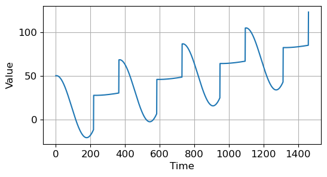
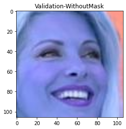
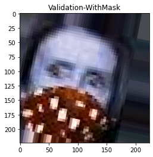
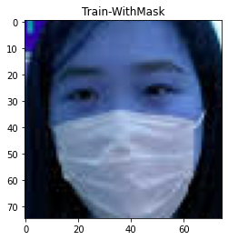
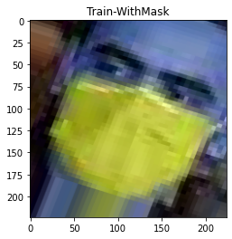
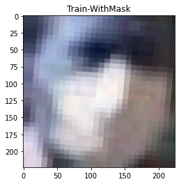
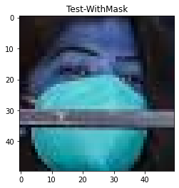
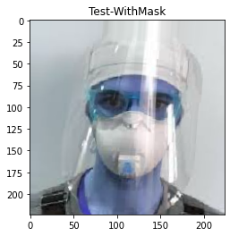
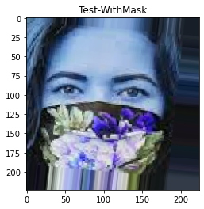
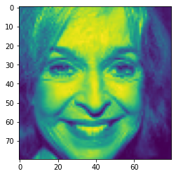

## 라이브러리 불러오기


```python
import numpy as np
import matplotlib.pyplot as plt
import tensorflow as tf
import pandas as pd
from tensorflow import keras
from sklearn.model_selection import train_test_split
from sklearn.metrics import confusion_matrix
from tensorflow.keras import layers,callbacks
from tensorflow import keras
from tensorflow.keras import layers
from tensorflow.keras.models import Sequential,save_model,load_model
from tensorflow.keras.layers import Dense,Dropout,Conv2D,MaxPool2D,Flatten
from tensorflow.keras.callbacks import EarlyStopping
import os
import cv2
import glob
```

## 데이터 불러오기
https://www.kaggle.com/code/egbeolajohn/nosemask-detection-with-99-accuracy


```python
pwd
```


    'C:\\Users\\juhee\\jh\\WPsolutions'


```python
path = "./FMD"
os.listdir(path)
```


    ['Test', 'Train', 'Validation']


```python
print(path)

image_path = []
label = []
location = []

for where in os.listdir(path):
    for status in os.listdir(path+"/"+where):
        for image in glob.glob(path+"/"+where+"/"+status+"/"+"*.png"):
            image_path.append(image)
            label.append(status)
            location.append(where)
            
data = pd.DataFrame({'image_path':image_path,'label':label,'location':location})
data.head()
```

    ./FMD
    


<div>
<style scoped>
    .dataframe tbody tr th:only-of-type {
        vertical-align: middle;
    }

    .dataframe tbody tr th {
        vertical-align: top;
    }

    .dataframe thead th {
        text-align: right;
    }
</style>
<table border="1" class="dataframe">
  <thead>
    <tr style="text-align: right;">
      <th></th>
      <th>image_path</th>
      <th>label</th>
      <th>location</th>
    </tr>
  </thead>
  <tbody>
    <tr>
      <th>0</th>
      <td>./FMD/Test/WithMask\1163.png</td>
      <td>WithMask</td>
      <td>Test</td>
    </tr>
    <tr>
      <th>1</th>
      <td>./FMD/Test/WithMask\1174.png</td>
      <td>WithMask</td>
      <td>Test</td>
    </tr>
    <tr>
      <th>2</th>
      <td>./FMD/Test/WithMask\1175.png</td>
      <td>WithMask</td>
      <td>Test</td>
    </tr>
    <tr>
      <th>3</th>
      <td>./FMD/Test/WithMask\1203.png</td>
      <td>WithMask</td>
      <td>Test</td>
    </tr>
    <tr>
      <th>4</th>
      <td>./FMD/Test/WithMask\1361.png</td>
      <td>WithMask</td>
      <td>Test</td>
    </tr>
  </tbody>
</table>
</div>


```python
#sample(frac=1)특정 비율의 표본을 무작위로 추출 

train_data =data[data['location']=='Train'].sample(frac=1) 
test_data = data[data['location']=='Test'].sample(frac=1)
validation_data = data[data['location']=='Validation'].sample(frac=1)


print(len(train_data))
print(len(test_data))
print(len(validation_data))
```

    10000
    992
    800
    


```python
def plot_images(data):
    for loc in range(3):
        plt.imshow(cv2.imread(data.iloc[loc,0]))
        plt.title(f'{data.iloc[loc,2]}-{data.iloc[loc,1]}')
        plt.show()
```

### 데이터 확인


```python
plot_images(validation_data)
plot_images(train_data)
plot_images(test_data)
```


    

    


    

    


    

    


    

    


    

    


    

    


    

    


    

    


    

    


## 데이터 전처리


```python
 def data_preprocessing(input_data):
    input_data = input_data.reset_index().drop("index", axis = 1)
    data = []
    for i in range(len(input_data)):
        img_array = cv2.imread(input_data["image_path"][i], cv2.IMREAD_GRAYSCALE)
        new_image_array = cv2.resize(img_array, (80,80)) #특성 사용 위해 동일한 차원으로 생성 
        # label이 WithMask이면 1 아니면 0 설정 
        if input_data["label"][i] == "WithMask": 
            data.append([new_image_array, 1])
        else:
            data.append([new_image_array, 0])
    data = np.array(data)
    X = [] #이미지 
    y = [] #라벨 
    for image in data:
        X.append(image[0])
        y.append(image[1])
    X = np.array(X)
    X = X/255 #정규화 실시 
    X = X.reshape(len(X),X.shape[1],X.shape[2], 1)
    y = np.array(y)
    return [X,y]
```


```python
Train_data = data_preprocessing(train_data)[0]
Train_labels = data_preprocessing(train_data)[1]
Validation_data = data_preprocessing(validation_data)[0]
Validation_labels = data_preprocessing(validation_data)[1]
```

    C:\Users\juhee\AppData\Local\Temp\ipykernel_27216\3268614286.py:11: VisibleDeprecationWarning: Creating an ndarray from ragged nested sequences (which is a list-or-tuple of lists-or-tuples-or ndarrays with different lengths or shapes) is deprecated. If you meant to do this, you must specify 'dtype=object' when creating the ndarray.
      data = np.array(data)
    C:\Users\juhee\AppData\Local\Temp\ipykernel_27216\3268614286.py:11: VisibleDeprecationWarning: Creating an ndarray from ragged nested sequences (which is a list-or-tuple of lists-or-tuples-or ndarrays with different lengths or shapes) is deprecated. If you meant to do this, you must specify 'dtype=object' when creating the ndarray.
      data = np.array(data)
    C:\Users\juhee\AppData\Local\Temp\ipykernel_27216\3268614286.py:11: VisibleDeprecationWarning: Creating an ndarray from ragged nested sequences (which is a list-or-tuple of lists-or-tuples-or ndarrays with different lengths or shapes) is deprecated. If you meant to do this, you must specify 'dtype=object' when creating the ndarray.
      data = np.array(data)
    C:\Users\juhee\AppData\Local\Temp\ipykernel_27216\3268614286.py:11: VisibleDeprecationWarning: Creating an ndarray from ragged nested sequences (which is a list-or-tuple of lists-or-tuples-or ndarrays with different lengths or shapes) is deprecated. If you meant to do this, you must specify 'dtype=object' when creating the ndarray.
      data = np.array(data)
    


```python
Train_data.shape,Train_labels.shape
```


    ((10000, 80, 80, 1), (10000,))


```python
Train_labels[:4]
```


    array([1, 1, 1, 0])


## CNN모델 생성
https://ichi.pro/ko/keonbol-lusyeon-singyeongmang-eul-sayonghayeo-anmyeon-maseukeuleul-gamjihaneun-peulogeulaem-mandeulgi-141818751100859

아래 Conv2D는 (Dense, Dropout, Conv2D, MaxPool2D 및 Flatten)의 5 개 레이어를 사용

* Convolution : convolution layer의 크기만큼 이동시켜 겹쳐지는 부분의 각 원소 값을 곱하여 모두 더한 값을 출력하는 층. 이미지 인식 시킬때, 주변의 값들의 관계를 알아내기 위해서 사용  
                     
                       
                       
* Relu : 음수 값을 0에 매핑하고 양수 값을 유지해 더 빠르고 효과적인 학습을 가능하게 함. 활성화된 특징만 넘겨주기 때문에 이 과정을 활성화라고 부름 
   
     
* binary_crossentropy : 클래스가 두개인 이진분류에서 사용 하는 것으로 label이 0 또는 1을 값으로 가질 때 사용. 모델의 마지막 레이어의 활성화 함수는 시그모이드 함수 사용
  
  
* Early Stoppong : 너무 많은 epoch 수행시 과적합 발생함으로 특정 시점에서 멈추는 것 
       
1. Conv2D 레이어는 제공된 인수 기반으로 필터 행렬 생성  - 3*3 필터가 레이어에 사용됨 
   이 블럭(3*3)으로 이미지 분석하고 Hadamard 제품의 합계 출력 

     *Hadamard (아다마르 행렬) : 모든 성분이 ±1이며, 행벡터들과 열벡터들이 서로 직교하는 정사각형 행렬  
       

2. MaxPool2D 레이어는 컨볼루션 된 이미지 데이터에서 가장 큰 값 출력

3. 이미지 분석이 완료된 후 Flatten 이 데이터를 1차원으로 만들어 추가로 작업할 수 있도록 설정 

4. Dense & Dropout 추가작업에 사용되며 최종 출력은 'With out Mask'의미하는 0 또는 'With Mask'의미하는 1 출력하는 단일 뉴런


```python
model = keras.Sequential()

model.add(Conv2D(64,(3,3),input_shape=Train_data.shape[1:],activation='relu'))
model.add(MaxPool2D(pool_size=(2,2)))

model.add(Conv2D(32,(3,3),activation='relu'))
model.add(MaxPool2D(pool_size=(2,2)))

model.add(Conv2D(64,(3,3),activation='relu'))
model.add(MaxPool2D(pool_size=(2,2)))

model.add(Flatten())

model.add(Dense(64,activation='relu'))
model.add(Dropout(0.5))
model.add(Dense(32,activation='relu'))

model.add(Dense(1,activation='sigmoid'))

model.compile(optimizer='adam',
            loss='binary_crossentropy', # 모델을 평가하는데 사용되는 손실함수 
            metrics=['accuracy'])

#모델의 과적합 방지위해서 사용 
# validation set의 loss값을 모니터링 하는 것으로 performance measure는 최소화 설정 
# patience 20 설정해서 증가하지 않느 epoch 20번 허용 
early_stopping = EarlyStopping(patience=20,monitor='val_loss',mode='min')


model.fit(Train_data,Train_labels,
    epochs=10,validation_data=[Validation_data,Validation_labels],
    callbacks=[early_stopping])
```

    Epoch 1/10
    313/313 [==============================] - 76s 242ms/step - loss: 0.2442 - accuracy: 0.8971 - val_loss: 0.0873 - val_accuracy: 0.9725
    Epoch 2/10
    313/313 [==============================] - 77s 245ms/step - loss: 0.0917 - accuracy: 0.9713 - val_loss: 0.0574 - val_accuracy: 0.9800
    Epoch 3/10
    313/313 [==============================] - 83s 264ms/step - loss: 0.0721 - accuracy: 0.9765 - val_loss: 0.0713 - val_accuracy: 0.9712
    Epoch 4/10
    313/313 [==============================] - 79s 254ms/step - loss: 0.0653 - accuracy: 0.9774 - val_loss: 0.0640 - val_accuracy: 0.9787
    Epoch 5/10
    313/313 [==============================] - 80s 256ms/step - loss: 0.0474 - accuracy: 0.9849 - val_loss: 0.0423 - val_accuracy: 0.9825
    Epoch 6/10
    313/313 [==============================] - 74s 236ms/step - loss: 0.0428 - accuracy: 0.9852 - val_loss: 0.0392 - val_accuracy: 0.9812
    Epoch 7/10
    313/313 [==============================] - 75s 239ms/step - loss: 0.0377 - accuracy: 0.9861 - val_loss: 0.0346 - val_accuracy: 0.9837
    Epoch 8/10
    313/313 [==============================] - 78s 249ms/step - loss: 0.0363 - accuracy: 0.9886 - val_loss: 0.0410 - val_accuracy: 0.9850
    Epoch 9/10
    313/313 [==============================] - 75s 238ms/step - loss: 0.0279 - accuracy: 0.9901 - val_loss: 0.0549 - val_accuracy: 0.9825
    Epoch 10/10
    313/313 [==============================] - 75s 240ms/step - loss: 0.0270 - accuracy: 0.9901 - val_loss: 0.0419 - val_accuracy: 0.9812
    


    <keras.callbacks.History at 0x1c851036c70>


```python
model.save ( 'model')
```

    INFO:tensorflow:Assets written to: model\assets
    


```python
model.summary()
```

    Model: "sequential_1"
    _________________________________________________________________
     Layer (type)                Output Shape              Param #   
    =================================================================
     conv2d_3 (Conv2D)           (None, 78, 78, 64)        640       
                                                                     
     max_pooling2d_3 (MaxPooling  (None, 39, 39, 64)       0         
     2D)                                                             
                                                                     
     conv2d_4 (Conv2D)           (None, 37, 37, 32)        18464     
                                                                     
     max_pooling2d_4 (MaxPooling  (None, 18, 18, 32)       0         
     2D)                                                             
                                                                     
     conv2d_5 (Conv2D)           (None, 16, 16, 64)        18496     
                                                                     
     max_pooling2d_5 (MaxPooling  (None, 8, 8, 64)         0         
     2D)                                                             
                                                                     
     flatten_1 (Flatten)         (None, 4096)              0         
                                                                     
     dense_3 (Dense)             (None, 64)                262208    
                                                                     
     dropout_1 (Dropout)         (None, 64)                0         
                                                                     
     dense_4 (Dense)             (None, 32)                2080      
                                                                     
     dense_5 (Dense)             (None, 1)                 33        
                                                                     
    =================================================================
    Total params: 301,921
    Trainable params: 301,921
    Non-trainable params: 0
    _________________________________________________________________
    

## Test 데이터 model 적용


```python
Test_data = data_preprocessing(test_data)[0]
Test_labels = data_preprocessing(test_data)[1]
```

    C:\Users\juhee\AppData\Local\Temp\ipykernel_27216\3268614286.py:11: VisibleDeprecationWarning: Creating an ndarray from ragged nested sequences (which is a list-or-tuple of lists-or-tuples-or ndarrays with different lengths or shapes) is deprecated. If you meant to do this, you must specify 'dtype=object' when creating the ndarray.
      data = np.array(data)
    C:\Users\juhee\AppData\Local\Temp\ipykernel_27216\3268614286.py:11: VisibleDeprecationWarning: Creating an ndarray from ragged nested sequences (which is a list-or-tuple of lists-or-tuples-or ndarrays with different lengths or shapes) is deprecated. If you meant to do this, you must specify 'dtype=object' when creating the ndarray.
      data = np.array(data)
    


```python
test_loss,test_acc = model.evaluate(Test_data,Test_labels)
print('Test Accuracy:', test_acc)
```

    31/31 [==============================] - 2s 55ms/step - loss: 0.0448 - accuracy: 0.9859
    Test Accuracy: 0.9858871102333069
    


```python
test_result = model.predict(Test_data)
```

## 예측확인

#### 훈련된 model 적용한 test의 예측값 


```python
np.argmax(test_result[5])
```


    0


#### 실제 데이터의 label 값 


```python
Test_labels[5]
```


    0


#### 실제 Test_data[0] 이미지 확인


```python
plt.figure()
plt.imshow(Test_data[5])
plt.show()
```


    

    

