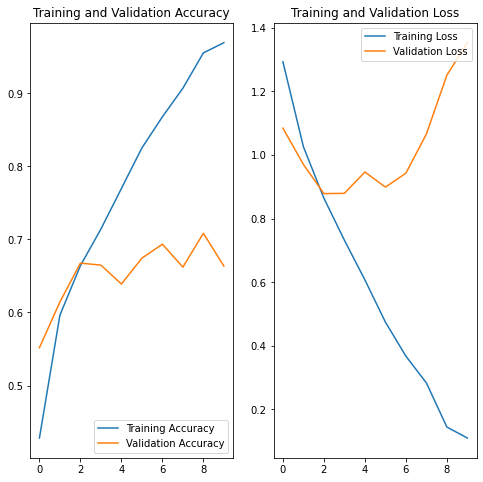
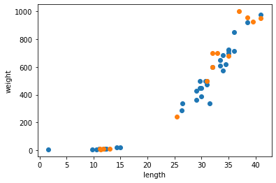
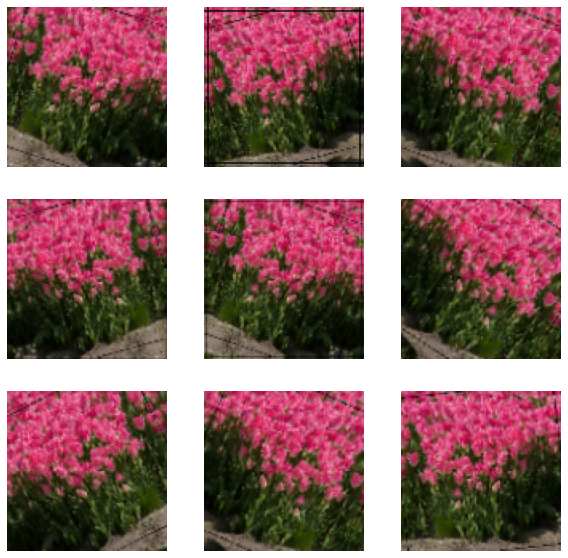

## 라이브러리 가져오기 


```python
import matplotlib.pyplot as plt
import numpy as np
import os
import PIL
import tensorflow as tf

from tensorflow import keras
from tensorflow.keras import layers
from tensorflow.keras.models import Sequential
```

## 데이터 불러오기

flower_photo [daisy,dandelion,roses,sunflowers,tulips]


```python
import pathlib
dataset_url = "https://storage.googleapis.com/download.tensorflow.org/example_images/flower_photos.tgz"
data_dir = tf.keras.utils.get_file('flower_photos', origin=dataset_url, untar=True)
data_dir = pathlib.Path(data_dir)
```


```python
image_count = len(list(data_dir.glob('*/*.jpg')))
print(image_count)
```

    3670
    


```python
roses = list(data_dir.glob('roses/*'))
PIL.Image.open(str(roses[3]))
```


    

    


```python
dandelion= list(data_dir.glob('dandelion/*'))
PIL.Image.open(str(dandelion[8]))
```


    

    


### Data set 


```python
batch_size,img_height,img_width = 32,100,100
```


```python
train_data = tf.keras.preprocessing.image_dataset_from_directory(
  data_dir,
  validation_split=0.2,
  subset="training",
  seed=123,
  image_size=(img_height, img_width),
  batch_size=batch_size)
```

    Found 3670 files belonging to 5 classes.
    Using 2936 files for training.
    


```python
val_data = tf.keras.preprocessing.image_dataset_from_directory(
  data_dir,
  validation_split=0.2,
  subset="validation",
  seed=123,
  image_size=(img_height, img_width),
  batch_size=batch_size)
```

    Found 3670 files belonging to 5 classes.
    Using 734 files for validation.
    


```python
class_names = train_data.class_names
print(class_names)
```

    ['daisy', 'dandelion', 'roses', 'sunflowers', 'tulips']
    


```python
import matplotlib.pyplot as plt

plt.figure(figsize = (10,10))

for img,labels in train_data.take(1):
    for i in range(9):
        ax = plt.subplot(3,3,i+1) # 3*3 사이즈에 0번부터 넣기 위해서 
        plt.imshow(img[i].numpy().astype('uint8'))
        plt.title(class_names[labels[i]])
        plt.axis('off')
```


    

    


## 모델 생성

180*'*'180*'*'3 크기의 이미지가 32개의 묶음으로 구성되어 있으며, 32개 이미지 해당하는 레이블로 구성


```python
for image_batch, labels_batch in train_data:
    print(image_batch.shape)
    print(labels_batch.shape)
    break
```

    (32, 100, 100, 3)
    (32,)
    


```python
normalization_layer = layers.experimental.preprocessing.Rescaling(1./255)
```


```python
num_classes = 5

model = Sequential([
  layers.experimental.preprocessing.Rescaling(1./255, input_shape=(img_height, img_width, 3)),
  layers.Conv2D(16, 3, padding='same', activation='relu'),
  layers.MaxPooling2D(),
  layers.Conv2D(32, 3, padding='same', activation='relu'),
  layers.MaxPooling2D(),
  layers.Conv2D(64, 3, padding='same', activation='relu'),
  layers.MaxPooling2D(),
  layers.Flatten(),
  layers.Dense(128, activation='relu'),
  layers.Dense(num_classes)
])
```


```python
model.compile(optimizer='adam',
              loss=tf.keras.losses.SparseCategoricalCrossentropy(from_logits=True),
              metrics=['accuracy'])
```


```python
model.summary()
```

    Model: "sequential"
    _________________________________________________________________
    Layer (type)                 Output Shape              Param #   
    =================================================================
    rescaling_1 (Rescaling)      (None, 100, 100, 3)       0         
    _________________________________________________________________
    conv2d (Conv2D)              (None, 100, 100, 16)      448       
    _________________________________________________________________
    max_pooling2d (MaxPooling2D) (None, 50, 50, 16)        0         
    _________________________________________________________________
    conv2d_1 (Conv2D)            (None, 50, 50, 32)        4640      
    _________________________________________________________________
    max_pooling2d_1 (MaxPooling2 (None, 25, 25, 32)        0         
    _________________________________________________________________
    conv2d_2 (Conv2D)            (None, 25, 25, 64)        18496     
    _________________________________________________________________
    max_pooling2d_2 (MaxPooling2 (None, 12, 12, 64)        0         
    _________________________________________________________________
    flatten (Flatten)            (None, 9216)              0         
    _________________________________________________________________
    dense (Dense)                (None, 128)               1179776   
    _________________________________________________________________
    dense_1 (Dense)              (None, 5)                 645       
    =================================================================
    Total params: 1,204,005
    Trainable params: 1,204,005
    Non-trainable params: 0
    _________________________________________________________________
    


```python
epochs=10
history = model.fit(
  train_data,
  validation_data=val_data,
  epochs=epochs
)
```

    Epoch 1/10
    92/92 [==============================] - 29s 310ms/step - loss: 1.2933 - accuracy: 0.4281 - val_loss: 1.0846 - val_accuracy: 0.5518
    Epoch 2/10
    92/92 [==============================] - 24s 264ms/step - loss: 1.0261 - accuracy: 0.5964 - val_loss: 0.9705 - val_accuracy: 0.6144
    Epoch 3/10
    92/92 [==============================] - 23s 249ms/step - loss: 0.8643 - accuracy: 0.6642 - val_loss: 0.8788 - val_accuracy: 0.6676
    Epoch 4/10
    92/92 [==============================] - 23s 253ms/step - loss: 0.7321 - accuracy: 0.7142 - val_loss: 0.8795 - val_accuracy: 0.6649
    Epoch 5/10
    92/92 [==============================] - 25s 269ms/step - loss: 0.6074 - accuracy: 0.7698 - val_loss: 0.9466 - val_accuracy: 0.6390
    Epoch 6/10
    92/92 [==============================] - 23s 251ms/step - loss: 0.4748 - accuracy: 0.8253 - val_loss: 0.8991 - val_accuracy: 0.6744
    Epoch 7/10
    92/92 [==============================] - 24s 257ms/step - loss: 0.3676 - accuracy: 0.8678 - val_loss: 0.9429 - val_accuracy: 0.6935
    Epoch 8/10
    92/92 [==============================] - 27s 297ms/step - loss: 0.2834 - accuracy: 0.9070 - val_loss: 1.0660 - val_accuracy: 0.6621
    Epoch 9/10
    92/92 [==============================] - 25s 273ms/step - loss: 0.1446 - accuracy: 0.9554 - val_loss: 1.2511 - val_accuracy: 0.7084
    Epoch 10/10
    92/92 [==============================] - 24s 263ms/step - loss: 0.1100 - accuracy: 0.9693 - val_loss: 1.3533 - val_accuracy: 0.6635
    


```python
acc = history.history['accuracy']
val_acc = history.history['val_accuracy']

loss=history.history['loss']
val_loss=history.history['val_loss']

epochs_range = range(epochs)

plt.figure(figsize=(8, 8))
plt.subplot(1, 2, 1)
plt.plot(epochs_range, acc, label='Training Accuracy')
plt.plot(epochs_range, val_acc, label='Validation Accuracy')
plt.legend(loc='lower right')
plt.title('Training and Validation Accuracy')

plt.subplot(1, 2, 2)
plt.plot(epochs_range, loss, label='Training Loss')
plt.plot(epochs_range, val_loss, label='Validation Loss')
plt.legend(loc='upper right')
plt.title('Training and Validation Loss')
plt.show()
```


    

    


train data와 val data 결과를 보면 train의 정확성과 손실성만 좋아진 걸 보아 과대적합된 것으로 예상됨.   
이러한 과대적합이 일어났을 경우 가장 간단한 방법은 규모를 축소하는 것으로 모델에 있는 학습 가능한 파라미터 수를 줄이는 것.  
파라미터는 층 개수와 unit수에 의해 결정.  

### 파라미터 수 줄여서 새로운 모델 생성 #1


```python
num_classes = 5

model = Sequential([
  layers.experimental.preprocessing.Rescaling(1./255, input_shape=(img_height, img_width, 3)),
  layers.Conv2D(8, 3, padding='same', activation='relu'),
  layers.MaxPooling2D(),
  layers.Conv2D(16, 3, padding='same', activation='relu'),
  layers.MaxPooling2D(),
  layers.Conv2D(32, 3, padding='same', activation='relu'),
  layers.MaxPooling2D(),
  layers.Flatten(),
  layers.Dense(64, activation='relu'),
  layers.Dense(num_classes)
])
```


```python
model.compile(optimizer='adam',
              loss=tf.keras.losses.SparseCategoricalCrossentropy(from_logits=True),
              metrics=['accuracy'])
```


```python
model.summary()
```

    Model: "sequential_1"
    _________________________________________________________________
    Layer (type)                 Output Shape              Param #   
    =================================================================
    rescaling_2 (Rescaling)      (None, 100, 100, 3)       0         
    _________________________________________________________________
    conv2d_3 (Conv2D)            (None, 100, 100, 8)       224       
    _________________________________________________________________
    max_pooling2d_3 (MaxPooling2 (None, 50, 50, 8)         0         
    _________________________________________________________________
    conv2d_4 (Conv2D)            (None, 50, 50, 16)        1168      
    _________________________________________________________________
    max_pooling2d_4 (MaxPooling2 (None, 25, 25, 16)        0         
    _________________________________________________________________
    conv2d_5 (Conv2D)            (None, 25, 25, 32)        4640      
    _________________________________________________________________
    max_pooling2d_5 (MaxPooling2 (None, 12, 12, 32)        0         
    _________________________________________________________________
    flatten_1 (Flatten)          (None, 4608)              0         
    _________________________________________________________________
    dense_2 (Dense)              (None, 64)                294976    
    _________________________________________________________________
    dense_3 (Dense)              (None, 5)                 325       
    =================================================================
    Total params: 301,333
    Trainable params: 301,333
    Non-trainable params: 0
    _________________________________________________________________
    


```python
epochs=10
history = model.fit(
  train_data,
  validation_data=val_data,
  epochs=epochs
)
```

    Epoch 1/10
    92/92 [==============================] - 18s 195ms/step - loss: 1.3353 - accuracy: 0.4254 - val_loss: 1.1184 - val_accuracy: 0.5422
    Epoch 2/10
    92/92 [==============================] - 18s 194ms/step - loss: 1.0307 - accuracy: 0.5909 - val_loss: 1.0093 - val_accuracy: 0.5995
    Epoch 3/10
    92/92 [==============================] - 18s 195ms/step - loss: 0.9262 - accuracy: 0.6356 - val_loss: 0.9816 - val_accuracy: 0.5981
    Epoch 4/10
    92/92 [==============================] - 19s 202ms/step - loss: 0.8342 - accuracy: 0.6761 - val_loss: 0.9180 - val_accuracy: 0.6335
    Epoch 5/10
    92/92 [==============================] - 19s 206ms/step - loss: 0.7432 - accuracy: 0.7153 - val_loss: 0.9582 - val_accuracy: 0.6199
    Epoch 6/10
    92/92 [==============================] - 18s 199ms/step - loss: 0.6723 - accuracy: 0.7514 - val_loss: 0.9991 - val_accuracy: 0.6144
    Epoch 7/10
    92/92 [==============================] - 19s 208ms/step - loss: 0.5740 - accuracy: 0.7936 - val_loss: 0.9614 - val_accuracy: 0.6376
    Epoch 8/10
    92/92 [==============================] - 22s 236ms/step - loss: 0.4732 - accuracy: 0.8321 - val_loss: 1.0092 - val_accuracy: 0.6117
    Epoch 9/10
    92/92 [==============================] - 19s 205ms/step - loss: 0.3731 - accuracy: 0.8713 - val_loss: 1.0201 - val_accuracy: 0.6308
    Epoch 10/10
    92/92 [==============================] - 19s 211ms/step - loss: 0.3068 - accuracy: 0.8971 - val_loss: 1.2471 - val_accuracy: 0.6104
    


```python
acc = history.history['accuracy']
val_acc = history.history['val_accuracy']

loss=history.history['loss']
val_loss=history.history['val_loss']

epochs_range = range(epochs)

plt.figure(figsize=(8, 8))
plt.subplot(1, 2, 1)
plt.plot(epochs_range, acc, label='Training Accuracy')
plt.plot(epochs_range, val_acc, label='Validation Accuracy')
plt.legend(loc='lower right')
plt.title('Training and Validation Accuracy')

plt.subplot(1, 2, 2)
plt.plot(epochs_range, loss, label='Training Loss')
plt.plot(epochs_range, val_loss, label='Validation Loss')
plt.legend(loc='upper right')
plt.title('Training and Validation Loss')
plt.show()
```


    

    


기존 모델에 출력 채널 수를 줄여서 확인해본 결과 그렇게 큰 차이가 나지 않는 것으로 보이며,  
오히려 시간을 생각해볼 때 출력 채널 수를 줄여서 모델을 생성해 train시키는 것이 더 나을 것으로 보임

### 파라미터 수 줄여서 새로운 모델 생성 #2


```python
num_classes = 5

model = Sequential([
  layers.experimental.preprocessing.Rescaling(1./255, input_shape=(img_height, img_width, 3)),
  layers.Conv2D(8, 3, padding='same', activation='relu'),
  layers.MaxPooling2D(),
  layers.Conv2D(16, 3, padding='same', activation='relu'),
  layers.MaxPooling2D(),
  layers.Flatten(),
  layers.Dense(64, activation='relu'),
  layers.Dense(num_classes)
])
```


```python
model.compile(optimizer='adam',
              loss=tf.keras.losses.SparseCategoricalCrossentropy(from_logits=True),
              metrics=['accuracy'])
```


```python
model.summary()
```

    Model: "sequential_2"
    _________________________________________________________________
    Layer (type)                 Output Shape              Param #   
    =================================================================
    rescaling_3 (Rescaling)      (None, 100, 100, 3)       0         
    _________________________________________________________________
    conv2d_6 (Conv2D)            (None, 100, 100, 8)       224       
    _________________________________________________________________
    max_pooling2d_6 (MaxPooling2 (None, 50, 50, 8)         0         
    _________________________________________________________________
    conv2d_7 (Conv2D)            (None, 50, 50, 16)        1168      
    _________________________________________________________________
    max_pooling2d_7 (MaxPooling2 (None, 25, 25, 16)        0         
    _________________________________________________________________
    flatten_2 (Flatten)          (None, 10000)             0         
    _________________________________________________________________
    dense_4 (Dense)              (None, 64)                640064    
    _________________________________________________________________
    dense_5 (Dense)              (None, 5)                 325       
    =================================================================
    Total params: 641,781
    Trainable params: 641,781
    Non-trainable params: 0
    _________________________________________________________________
    


```python
epochs=10
history = model.fit(
  train_data,
  validation_data=val_data,
  epochs=epochs
)
```

    Epoch 1/10
    92/92 [==============================] - 17s 185ms/step - loss: 1.2986 - accuracy: 0.4332 - val_loss: 1.1113 - val_accuracy: 0.5450
    Epoch 2/10
    92/92 [==============================] - 16s 176ms/step - loss: 1.0329 - accuracy: 0.5831 - val_loss: 1.0549 - val_accuracy: 0.5872
    Epoch 3/10
    92/92 [==============================] - 18s 197ms/step - loss: 0.9186 - accuracy: 0.6390 - val_loss: 1.0072 - val_accuracy: 0.6104
    Epoch 4/10
    92/92 [==============================] - 17s 189ms/step - loss: 0.8243 - accuracy: 0.6904 - val_loss: 1.0066 - val_accuracy: 0.6226
    Epoch 5/10
    92/92 [==============================] - 16s 177ms/step - loss: 0.7148 - accuracy: 0.7347 - val_loss: 1.0014 - val_accuracy: 0.5981
    Epoch 6/10
    92/92 [==============================] - 17s 180ms/step - loss: 0.6124 - accuracy: 0.7732 - val_loss: 0.9795 - val_accuracy: 0.6144
    Epoch 7/10
    92/92 [==============================] - 17s 182ms/step - loss: 0.5120 - accuracy: 0.8307 - val_loss: 1.0375 - val_accuracy: 0.6213
    Epoch 8/10
    92/92 [==============================] - 16s 176ms/step - loss: 0.4161 - accuracy: 0.8648 - val_loss: 1.0454 - val_accuracy: 0.6294
    Epoch 9/10
    92/92 [==============================] - 16s 179ms/step - loss: 0.3104 - accuracy: 0.9046 - val_loss: 1.1504 - val_accuracy: 0.6131
    Epoch 10/10
    92/92 [==============================] - 16s 170ms/step - loss: 0.2427 - accuracy: 0.9363 - val_loss: 1.2323 - val_accuracy: 0.6444
    


```python
acc = history.history['accuracy']
val_acc = history.history['val_accuracy']

loss=history.history['loss']
val_loss=history.history['val_loss']

epochs_range = range(epochs)

plt.figure(figsize=(8, 8))
plt.subplot(1, 2, 1)
plt.plot(epochs_range, acc, label='Training Accuracy')
plt.plot(epochs_range, val_acc, label='Validation Accuracy')
plt.legend(loc='lower right')
plt.title('Training and Validation Accuracy')

plt.subplot(1, 2, 2)
plt.plot(epochs_range, loss, label='Training Loss')
plt.plot(epochs_range, val_loss, label='Validation Loss')
plt.legend(loc='upper right')
plt.title('Training and Validation Loss')
plt.show()
```


    

    


층수를 줄여서 돌려본 결과 그래프 모양들은 비교적 비슷한 모양을 보여주고 있음.

### 가중치 규제하기

엔트로피가 작은 모델을 생성  
가중치가 작은 값을 가지도록 네트워크 복잡도에 제약을 가하는 것으로 가중치 값의 분포를 균일하게 만들어줌  
손실 함수에 큰 가중치에 해당하는 것을 추가하는 것으로 아래와 같이 두가지 규제가 있음  
  
* L1규제 : 절댓값에 비례하는 비용 추가 / 파라미터 0으로 만듦
* L2규제 : 가중치의 제곱에 비례하는 비용 추가 / 파라미터 제한하지만 0으로 만들진 않음


```python
l2_model = keras.models.Sequential([
  layers.experimental.preprocessing.Rescaling(1./255, input_shape=(img_height, img_width, 3)),
  layers.Conv2D(16, 3, padding='same', kernel_regularizer=keras.regularizers.l2(0.001),activation='relu'),
  layers.MaxPooling2D(),
  layers.Conv2D(32, 3, padding='same', kernel_regularizer=keras.regularizers.l2(0.001), activation='relu'),
  layers.MaxPooling2D(),
  layers.Conv2D(64, 3, padding='same', kernel_regularizer=keras.regularizers.l2(0.001), activation='relu'),
  layers.MaxPooling2D(),
  layers.Flatten(),
  layers.Dense(128, activation='relu'),
  layers.Dense(num_classes)
])

l2_model.compile(optimizer='adam',
              loss=tf.keras.losses.SparseCategoricalCrossentropy(from_logits=True),
              metrics=['accuracy'])

l2_model.summary()
```

    Model: "sequential_3"
    _________________________________________________________________
    Layer (type)                 Output Shape              Param #   
    =================================================================
    rescaling_4 (Rescaling)      (None, 100, 100, 3)       0         
    _________________________________________________________________
    conv2d_8 (Conv2D)            (None, 100, 100, 16)      448       
    _________________________________________________________________
    max_pooling2d_8 (MaxPooling2 (None, 50, 50, 16)        0         
    _________________________________________________________________
    conv2d_9 (Conv2D)            (None, 50, 50, 32)        4640      
    _________________________________________________________________
    max_pooling2d_9 (MaxPooling2 (None, 25, 25, 32)        0         
    _________________________________________________________________
    conv2d_10 (Conv2D)           (None, 25, 25, 64)        18496     
    _________________________________________________________________
    max_pooling2d_10 (MaxPooling (None, 12, 12, 64)        0         
    _________________________________________________________________
    flatten_3 (Flatten)          (None, 9216)              0         
    _________________________________________________________________
    dense_6 (Dense)              (None, 128)               1179776   
    _________________________________________________________________
    dense_7 (Dense)              (None, 5)                 645       
    =================================================================
    Total params: 1,204,005
    Trainable params: 1,204,005
    Non-trainable params: 0
    _________________________________________________________________
    


```python
l2_model_history = l2_model.fit(train_data,
                                epochs=10,
                                batch_size=batch_size,
                                validation_data=val_data,
                                verbose =1 )
```

    Epoch 1/10
    92/92 [==============================] - 23s 252ms/step - loss: 0.6697 - accuracy: 0.7636 - val_loss: 0.9809 - val_accuracy: 0.6349
    Epoch 2/10
    92/92 [==============================] - 24s 261ms/step - loss: 0.5411 - accuracy: 0.8205 - val_loss: 1.0917 - val_accuracy: 0.6349
    Epoch 3/10
    92/92 [==============================] - 23s 250ms/step - loss: 0.4307 - accuracy: 0.8610 - val_loss: 1.0282 - val_accuracy: 0.6649
    Epoch 4/10
    92/92 [==============================] - 23s 254ms/step - loss: 0.3173 - accuracy: 0.9080 - val_loss: 1.1765 - val_accuracy: 0.6526
    Epoch 5/10
    92/92 [==============================] - 24s 259ms/step - loss: 0.2495 - accuracy: 0.9401 - val_loss: 1.3477 - val_accuracy: 0.6703
    Epoch 6/10
    92/92 [==============================] - 24s 262ms/step - loss: 0.2025 - accuracy: 0.9540 - val_loss: 1.4773 - val_accuracy: 0.6567
    Epoch 7/10
    92/92 [==============================] - 23s 250ms/step - loss: 0.1766 - accuracy: 0.9646 - val_loss: 1.5572 - val_accuracy: 0.6294
    Epoch 8/10
    92/92 [==============================] - 23s 254ms/step - loss: 0.1319 - accuracy: 0.9823 - val_loss: 1.5563 - val_accuracy: 0.6649
    Epoch 9/10
    92/92 [==============================] - 24s 264ms/step - loss: 0.1339 - accuracy: 0.9792 - val_loss: 1.5816 - val_accuracy: 0.6553
    Epoch 10/10
    92/92 [==============================] - 25s 273ms/step - loss: 0.1408 - accuracy: 0.9792 - val_loss: 1.6954 - val_accuracy: 0.6580
    


```python
acc = history.history['accuracy']
val_acc = history.history['val_accuracy']

loss=history.history['loss']
val_loss=history.history['val_loss']

epochs_range = range(epochs)

plt.figure(figsize=(8, 8))
plt.subplot(1, 2, 1)
plt.plot(epochs_range, acc, label='Training Accuracy')
plt.plot(epochs_range, val_acc, label='Validation Accuracy')
plt.legend(loc='lower right')
plt.title('Training and Validation Accuracy')

plt.subplot(1, 2, 2)
plt.plot(epochs_range, loss, label='Training Loss')
plt.plot(epochs_range, val_loss, label='Validation Loss')
plt.legend(loc='upper right')
plt.title('Training and Validation Loss')
plt.show()
```


    

    


결과를 보면 꽃 데이터에는 가중치를 쓰는 것이 더 좋지 않은 것으로 보임

### 데이터 증강
임의 변환을 통해 추가 훈련 데이터를 생성


```python
data_augmentation = keras.Sequential(
  [
    layers.experimental.preprocessing.RandomFlip("horizontal", 
                                                 input_shape=(img_height, 
                                                              img_width,
                                                              3)),
    layers.experimental.preprocessing.RandomRotation(0.1),
    layers.experimental.preprocessing.RandomZoom(0.1),
  ]
)
```


```python
plt.figure(figsize=(10, 10))
for images, _ in train_data.take(1):
    for i in range(9):
        augmented_images = data_augmentation(images)
        ax = plt.subplot(3, 3, i + 1)
        plt.imshow(augmented_images[0].numpy().astype("uint8"))
        plt.axis("off")
```


    

    


## 드롭아웃 
여러 출력 단위가 무작위로 드롭아웃 됨.  
입력값은 소수로 설정하고 이는 출력 단위의 nn%를 임의로 제거하는 것을 의미


```python
model = Sequential([
  data_augmentation,
  layers.experimental.preprocessing.Rescaling(1./255),
  layers.Conv2D(16, 3, padding='same', activation='relu'),
  layers.MaxPooling2D(),
  layers.Conv2D(32, 3, padding='same', activation='relu'),
  layers.MaxPooling2D(),
  layers.Conv2D(64, 3, padding='same', activation='relu'),
  layers.MaxPooling2D(),
  layers.Dropout(0.2),
  layers.Flatten(),
  layers.Dense(128, activation='relu'),
  layers.Dense(num_classes)
])
```


```python
model.compile(optimizer='adam',
              loss=tf.keras.losses.SparseCategoricalCrossentropy(from_logits=True),
              metrics=['accuracy'])
```


```python
model.summary()
```

    Model: "sequential_5"
    _________________________________________________________________
    Layer (type)                 Output Shape              Param #   
    =================================================================
    sequential_4 (Sequential)    (None, 100, 100, 3)       0         
    _________________________________________________________________
    rescaling_5 (Rescaling)      (None, 100, 100, 3)       0         
    _________________________________________________________________
    conv2d_11 (Conv2D)           (None, 100, 100, 16)      448       
    _________________________________________________________________
    max_pooling2d_11 (MaxPooling (None, 50, 50, 16)        0         
    _________________________________________________________________
    conv2d_12 (Conv2D)           (None, 50, 50, 32)        4640      
    _________________________________________________________________
    max_pooling2d_12 (MaxPooling (None, 25, 25, 32)        0         
    _________________________________________________________________
    conv2d_13 (Conv2D)           (None, 25, 25, 64)        18496     
    _________________________________________________________________
    max_pooling2d_13 (MaxPooling (None, 12, 12, 64)        0         
    _________________________________________________________________
    dropout (Dropout)            (None, 12, 12, 64)        0         
    _________________________________________________________________
    flatten_4 (Flatten)          (None, 9216)              0         
    _________________________________________________________________
    dense_8 (Dense)              (None, 128)               1179776   
    _________________________________________________________________
    dense_9 (Dense)              (None, 5)                 645       
    =================================================================
    Total params: 1,204,005
    Trainable params: 1,204,005
    Non-trainable params: 0
    _________________________________________________________________
    


```python
epochs = 15
history = model.fit(
  train_data,
  validation_data=val_data,
  epochs=epochs
)
```

    Epoch 1/15
    92/92 [==============================] - 26s 282ms/step - loss: 1.3767 - accuracy: 0.4108 - val_loss: 1.1312 - val_accuracy: 0.5409
    Epoch 2/15
    92/92 [==============================] - 27s 293ms/step - loss: 1.0685 - accuracy: 0.5651 - val_loss: 1.0093 - val_accuracy: 0.5940
    Epoch 3/15
    92/92 [==============================] - 30s 330ms/step - loss: 0.9843 - accuracy: 0.6087 - val_loss: 0.9433 - val_accuracy: 0.6213
    Epoch 4/15
    92/92 [==============================] - 28s 303ms/step - loss: 0.9242 - accuracy: 0.6424 - val_loss: 0.9458 - val_accuracy: 0.6035
    Epoch 5/15
    92/92 [==============================] - 28s 301ms/step - loss: 0.8550 - accuracy: 0.6672 - val_loss: 0.9246 - val_accuracy: 0.6335
    Epoch 6/15
    92/92 [==============================] - 28s 301ms/step - loss: 0.8288 - accuracy: 0.6863 - val_loss: 1.2096 - val_accuracy: 0.5559
    Epoch 7/15
    92/92 [==============================] - 28s 308ms/step - loss: 0.8035 - accuracy: 0.6870 - val_loss: 0.7984 - val_accuracy: 0.6676
    Epoch 8/15
    92/92 [==============================] - 28s 303ms/step - loss: 0.7747 - accuracy: 0.7037 - val_loss: 0.8037 - val_accuracy: 0.6771
    Epoch 9/15
    92/92 [==============================] - 28s 305ms/step - loss: 0.7335 - accuracy: 0.7173 - val_loss: 0.8791 - val_accuracy: 0.6621
    Epoch 10/15
    92/92 [==============================] - 28s 305ms/step - loss: 0.7110 - accuracy: 0.7313 - val_loss: 0.8023 - val_accuracy: 0.6812
    Epoch 11/15
    92/92 [==============================] - 27s 297ms/step - loss: 0.6749 - accuracy: 0.7449 - val_loss: 0.7666 - val_accuracy: 0.6948
    Epoch 12/15
    92/92 [==============================] - 29s 315ms/step - loss: 0.6511 - accuracy: 0.7456 - val_loss: 0.8515 - val_accuracy: 0.6689
    Epoch 13/15
    92/92 [==============================] - 28s 302ms/step - loss: 0.6423 - accuracy: 0.7531 - val_loss: 0.7455 - val_accuracy: 0.7139
    Epoch 14/15
    92/92 [==============================] - 28s 300ms/step - loss: 0.6004 - accuracy: 0.7752 - val_loss: 0.8056 - val_accuracy: 0.6866
    Epoch 15/15
    92/92 [==============================] - 28s 301ms/step - loss: 0.5871 - accuracy: 0.7745 - val_loss: 0.8189 - val_accuracy: 0.7003
    


```python
acc = history.history['accuracy']
val_acc = history.history['val_accuracy']

loss = history.history['loss']
val_loss = history.history['val_loss']

epochs_range = range(epochs)

plt.figure(figsize=(8, 8))
plt.subplot(1, 2, 1)
plt.plot(epochs_range, acc, label='Training Accuracy')
plt.plot(epochs_range, val_acc, label='Validation Accuracy')
plt.legend(loc='lower right')
plt.title('Training and Validation Accuracy')

plt.subplot(1, 2, 2)
plt.plot(epochs_range, loss, label='Training Loss')
plt.plot(epochs_range, val_loss, label='Validation Loss')
plt.legend(loc='upper right')
plt.title('Training and Validation Loss')
plt.show()
```


    

    


### 새로운 데이터로 예측하기


```python
sunflower_url = "https://storage.googleapis.com/download.tensorflow.org/example_images/592px-Red_sunflower.jpg"
sunflower_path = tf.keras.utils.get_file('Red_sunflower', origin=sunflower_url)

img = keras.preprocessing.image.load_img(
    sunflower_path, target_size=(img_height, img_width)
)
img_array = keras.preprocessing.image.img_to_array(img)
img_array = tf.expand_dims(img_array, 0) # Create a batch

predictions = model.predict(img_array)
score = tf.nn.softmax(predictions[0])

print(
    "This image most likely belongs to {} with a {:.2f} percent confidence."
    .format(class_names[np.argmax(score)], 100 * np.max(score))
)
```

    Downloading data from https://storage.googleapis.com/download.tensorflow.org/example_images/592px-Red_sunflower.jpg
    122880/117948 [===============================] - 0s 0us/step
    This image most likely belongs to sunflowers with a 78.88 percent confidence.
    
