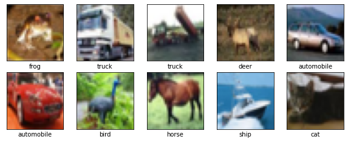

## 라이브러리 불러오기


```python
import tensorflow as tf

from tensorflow.keras import datasets, layers, models
import matplotlib.pyplot as plt
```

## 데이터 불러오기
CIFAR images 로 10개의 클래스 갖는 32*32 컬러 이미지들로 구성  
학습이미지 50k / 텍스트 이미지 10k 로 총 60k의 이미지로 구성


```python
(train_images, train_labels), (test_images, test_labels) = datasets.cifar10.load_data()
```

    Downloading data from https://www.cs.toronto.edu/~kriz/cifar-10-python.tar.gz
    170500096/170498071 [==============================] - 184s 1us/step
    170508288/170498071 [==============================] - 184s 1us/step
    

## 정규화


```python
train_images, test_images = train_images / 255.0, test_images / 255.0
```

## 이미지 살펴보기


```python
class_names = ['airplane', 'automobile', 'bird', 'cat', 'deer',
               'dog', 'frog', 'horse', 'ship', 'truck']

plt.figure(figsize=(10,10))

for i in range(10):
    plt.subplot(5,5,i+1)
    plt.xticks([])
    plt.yticks([])
    plt.grid(False)
    plt.imshow(train_images[i], cmap=plt.cm.binary)
    plt.xlabel(class_names[train_labels[i][0]])#숫자로 되어있는 거 label 목록의 해당 이름으로 변경 
plt.show()
```


    

    


## CNN모델 생성

tf.keras.layers.Conv2D (출력채널수, 필터크기,활성화함수,입력데이터 모양설정)
* 활성화 함수  
  
https://reniew.github.io/12/  
  
  
딥러닝 네트워크에서 노드에 입력된 값들을 비선형 함수에 통과시킨 후 다음 레이어로 전달  
1. Sigmoid 함수   
logistic이라 불리기도 하며 x의 값에 따라 0-1의 값을 출력하는 s자형 함수로 음수 값을 0에 가깝게 표현에 최종 레이어에 미치는 영향이 적어지는 Vanishing Gradient Problem문제 발생  
        *  Vanishing Gradient 기울기 소실 : 기울기가 점차적으로 작아지는 현상이 발생할 수 있는데 입력층에 가까운 층들에서 업데이트가 제대로 되지 않아 최적의 모델을 찾을 수 없는 문제를 말함.
2. Tanh 함수  
Sigmoid 함수를 변형한 함수로 tanh 함수는 함수의 중심점을 0으로 옮겨 sigmoid가 갖고 있는 최적화 과정에서 느려지는 문제 해결하지만 일정 값 이상에서는 미분 값이 소실되는 문제 여전히 발생  
3. Relu 함수    
가장 많이 사용되는 활성화 함수 중 하나로 Gradient Vanishing 문제 해결해줌. x가 0보다 크면 기울기가 1인 직선/ 0보다 작으면 함수 값을 0으로 설정하여 0보다 작은 값들에 대해 뉴런이 죽을 수 있는 단점 야기하지만 위의 함수들보다 빠름

### #1 
은닉층 4개와 출력층 한개로 구성


```python
model = tf.keras.Sequential([
    #tf.keras.layers.Conv2D (출력채널수, 필터크기,활성화함수,입력데이터 모양설정)
    tf.keras.layers.Conv2D(32, (3, 3), activation='relu', input_shape=(32, 32, 3)),
    tf.keras.layers.MaxPooling2D((2,2)),
    tf.keras.layers.Conv2D(64, (3, 3), activation='relu'),
    tf.keras.layers.MaxPooling2D((2, 2)),
    tf.keras.layers.Conv2D(64, (3, 3), activation='relu'),
    tf.keras.layers.Flatten(),
    tf.keras.layers.Dense(64,activation='relu'),
    tf.keras.layers.Dense(10,activation='softmax')
])
```

### #2   
#1가 같은 방법이지만  
model.add방법 사용해 tf.keras.layers 반복x  
Sequential 만들어 add로 레이어 추가하는 방법 


```python
model = models.Sequential()

model.add(layers.Conv2D(32, (3, 3), activation='relu', input_shape=(32, 32, 3)))
model.add(layers.MaxPooling2D((2, 2)))
model.add(layers.Conv2D(64, (3, 3), activation='relu'))
model.add(layers.MaxPooling2D((2, 2)))
model.add(layers.Conv2D(64, (3, 3), activation='relu'))
```

### 모델 요약 


```python
model.summary()
```

    Model: "sequential_1"
    _________________________________________________________________
     Layer (type)                Output Shape              Param #   
    =================================================================
     conv2d_3 (Conv2D)           (None, 30, 30, 32)        896       
                                                                     
     max_pooling2d_2 (MaxPooling  (None, 15, 15, 32)       0         
     2D)                                                             
                                                                     
     conv2d_4 (Conv2D)           (None, 13, 13, 64)        18496     
                                                                     
     max_pooling2d_3 (MaxPooling  (None, 6, 6, 64)         0         
     2D)                                                             
                                                                     
     conv2d_5 (Conv2D)           (None, 4, 4, 64)          36928     
                                                                     
    =================================================================
    Total params: 56,320
    Trainable params: 56,320
    Non-trainable params: 0
    _________________________________________________________________
    

conv2d_3 (Conv2D)  : (32,32,3)이 1번 은닉층에서  no-padding(패딩사이즈 지정 없으면 생략 가능)을 통해 (30,30)으로 사이즈 줄어든 것 확인할 수 있음 / 896 = ((3,3)*3(r,g,b 각각에 3**3)+1)*32  
  - (None, 30, 30, 32)에서 32개의 kernel 가진 것을 뜻하며 kernel은 하나의 convoluted(=feature map)이미지를 갖는 것
  
max_pooling2d_2(MaxPooling2D) : 2*2 풀링을 통해 이미지 크기 15로 줄어듦. feature는 여전히 32  
  
conv2d_4 (Conv2D) : 3*3 픽셀로 구성된 커널 64개 갖고 no-padding으로 사이즈 역시 13으로 줄어듦
  
max_pooling2d_2(MaxPooling2D) : 2*2 풀링 통해 이미지 크기가 6으로 줄어듦  

conv2d_5 (Conv2D) : 마찬가지로 3*3 픽셀로 구성된 커널 64개 갖고 no-padding으로 사이즈 역시 4로 변경  
  


  


### 모델에 Dense layer 추가
분류를 하기 위해서 추가하는 것으로 1차원 벡터를 갖는 dense layer 추가하며 앞의 convolutional레이어의 output을 쪼개야하기 때문에 3차원의 tensor를 1차원의 tesnor로 바꾸기 위해 flatten()을 사용    
softmax함수는 다중 클래스 분류를 하기 위해서 사용


```python
model.add(layers.Flatten())
model.add(layers.Dense(64, activation='relu'))
model.add(layers.Dense(10, activation='softmax'))
```


```python
model.summary()
```

    Model: "sequential_1"
    _________________________________________________________________
     Layer (type)                Output Shape              Param #   
    =================================================================
     conv2d_3 (Conv2D)           (None, 30, 30, 32)        896       
                                                                     
     max_pooling2d_2 (MaxPooling  (None, 15, 15, 32)       0         
     2D)                                                             
                                                                     
     conv2d_4 (Conv2D)           (None, 13, 13, 64)        18496     
                                                                     
     max_pooling2d_3 (MaxPooling  (None, 6, 6, 64)         0         
     2D)                                                             
                                                                     
     conv2d_5 (Conv2D)           (None, 4, 4, 64)          36928     
                                                                     
     flatten_1 (Flatten)         (None, 1024)              0         
                                                                     
     dense_2 (Dense)             (None, 64)                65600     
                                                                     
     dense_3 (Dense)             (None, 10)                650       
                                                                     
    =================================================================
    Total params: 122,570
    Trainable params: 122,570
    Non-trainable params: 0
    _________________________________________________________________
    

flatten_1 (Flatten) (None, 1024) : 마지막 합성곱 레이어  (None, 4, 4, 64)에서 flatten 을 통해 4*4*64 1024개의 원소 생성  
 
(None, 64): dense layer에 65개 노드 있고 위로부터 1024개의 input과 편향과 가중치 1개로 (1024+1)*64로 총 65600의 파라미터 값 생성  
  
마지막 줄 역시 마찬가지로 구성

## 모델 complie하고 학습  

* categorical_crossentropy ; 다중 분류 손실함수
출력이 원핫인코딩된 결과로 나오고 실측 결과와의 비교시에도 실측 결과는 원핫 인코딩 형태로 구성  
모델 구성시에 Dense(3, activation='softmax')라면 3개의 클래스로 각각 별로 positive 확률값이 나오게 됨  
  
    
* sparse_categorical_crossentropy ; 다중 분류 손실함수
위와 동일한 방식이지만 integer type 클래스라는 것이 다름  
원핫인코딩을 할 필요가 없이 정수로 positive 값이 나옴 


```python
model.compile(optimizer='adam',
              loss='sparse_categorical_crossentropy',
              metrics=['accuracy'])

history = model.fit(train_images, train_labels, epochs=10, 
                    validation_data=(test_images, test_labels))
```

    Epoch 1/10
    1563/1563 [==============================] - 47s 29ms/step - loss: 1.5171 - accuracy: 0.4442 - val_loss: 1.2281 - val_accuracy: 0.5555
    Epoch 2/10
    1563/1563 [==============================] - 45s 29ms/step - loss: 1.1412 - accuracy: 0.5965 - val_loss: 1.0318 - val_accuracy: 0.6327
    Epoch 3/10
    1563/1563 [==============================] - 52s 33ms/step - loss: 0.9876 - accuracy: 0.6544 - val_loss: 0.9513 - val_accuracy: 0.6644
    Epoch 4/10
    1563/1563 [==============================] - 48s 31ms/step - loss: 0.8909 - accuracy: 0.6879 - val_loss: 0.9296 - val_accuracy: 0.6766
    Epoch 5/10
    1563/1563 [==============================] - 45s 29ms/step - loss: 0.8229 - accuracy: 0.7132 - val_loss: 0.8823 - val_accuracy: 0.6933
    Epoch 6/10
    1563/1563 [==============================] - 51s 32ms/step - loss: 0.7624 - accuracy: 0.7347 - val_loss: 0.8757 - val_accuracy: 0.6984
    Epoch 7/10
    1563/1563 [==============================] - 53s 34ms/step - loss: 0.7163 - accuracy: 0.7500 - val_loss: 0.8441 - val_accuracy: 0.7133
    Epoch 8/10
    1563/1563 [==============================] - 55s 35ms/step - loss: 0.6758 - accuracy: 0.7655 - val_loss: 0.8744 - val_accuracy: 0.7066
    Epoch 9/10
    1563/1563 [==============================] - 48s 30ms/step - loss: 0.6326 - accuracy: 0.7786 - val_loss: 0.8273 - val_accuracy: 0.7169
    Epoch 10/10
    1563/1563 [==============================] - 47s 30ms/step - loss: 0.5988 - accuracy: 0.7915 - val_loss: 0.8673 - val_accuracy: 0.7168
    

## 모델 평가


```python
test_loss, test_acc = model.evaluate(test_images,  test_labels, verbose=1)
```

    313/313 [==============================] - 2s 7ms/step - loss: 0.8673 - accuracy: 0.7168
    


```python
print(test_acc)
```

    0.7167999744415283
    


```python
class_names = ['airplane', 'automobile', 'bird', 'cat', 'deer',
               'dog', 'frog', 'horse', 'ship', 'truck']

plt.figure(figsize=(10,10))

for i in range(10):
    plt.subplot(5,5,i+1)
    plt.xticks([])
    plt.yticks([])
    plt.grid(False)
    plt.imshow(test_images[i], cmap=plt.cm.binary)
    plt.xlabel(class_names[test_labels[i][0]])
plt.show()
```


    

    


```python
predictions = model.predict(test_images)
```


```python
predictions[0]
```


    array([5.3787730e-08, 3.9641130e-09, 3.2828396e-08, 9.9999976e-01,
           6.0309778e-11, 8.0484782e-08, 1.4415250e-11, 3.2680282e-11,
           4.5680498e-08, 5.5859457e-13], dtype=float32)


```python
np.argmax(predictions[0])
```


    3


```python
test_labels[0]
```


    array([3], dtype=uint8)


#### #loss값이 생각보다 큰 것 같아 이를 줄여보기 위해서 epochs값을 20으로 변경해봄


```python
model.compile(optimizer='adam',
              loss='sparse_categorical_crossentropy',
              metrics=['accuracy'])

history = model.fit(train_images, train_labels, epochs=20, 
                    validation_data=(test_images, test_labels))
```

    Epoch 1/20
    1563/1563 [==============================] - 44s 28ms/step - loss: 0.5655 - accuracy: 0.8026 - val_loss: 0.8561 - val_accuracy: 0.7220
    Epoch 2/20
    1563/1563 [==============================] - 44s 28ms/step - loss: 0.5249 - accuracy: 0.8154 - val_loss: 0.8755 - val_accuracy: 0.7169
    Epoch 3/20
    1563/1563 [==============================] - 43s 28ms/step - loss: 0.4969 - accuracy: 0.8252 - val_loss: 0.8866 - val_accuracy: 0.7188
    Epoch 4/20
    1563/1563 [==============================] - 44s 28ms/step - loss: 0.4698 - accuracy: 0.8324 - val_loss: 0.9161 - val_accuracy: 0.7122
    Epoch 5/20
    1563/1563 [==============================] - 44s 28ms/step - loss: 0.4410 - accuracy: 0.8451 - val_loss: 0.9580 - val_accuracy: 0.7158
    Epoch 6/20
    1563/1563 [==============================] - 47s 30ms/step - loss: 0.4143 - accuracy: 0.8538 - val_loss: 0.9630 - val_accuracy: 0.7238
    Epoch 7/20
    1563/1563 [==============================] - 46s 30ms/step - loss: 0.3919 - accuracy: 0.8608 - val_loss: 1.0643 - val_accuracy: 0.7092
    Epoch 8/20
    1563/1563 [==============================] - 47s 30ms/step - loss: 0.3613 - accuracy: 0.8701 - val_loss: 1.0852 - val_accuracy: 0.7034
    Epoch 9/20
    1563/1563 [==============================] - 41s 26ms/step - loss: 0.3442 - accuracy: 0.8782 - val_loss: 1.0799 - val_accuracy: 0.7129
    Epoch 10/20
    1563/1563 [==============================] - 43s 27ms/step - loss: 0.3220 - accuracy: 0.8859 - val_loss: 1.1252 - val_accuracy: 0.7129
    Epoch 11/20
    1563/1563 [==============================] - 42s 27ms/step - loss: 0.3055 - accuracy: 0.8913 - val_loss: 1.1785 - val_accuracy: 0.7077
    Epoch 12/20
    1563/1563 [==============================] - 45s 28ms/step - loss: 0.2804 - accuracy: 0.9006 - val_loss: 1.2429 - val_accuracy: 0.7045
    Epoch 13/20
    1563/1563 [==============================] - 44s 28ms/step - loss: 0.2710 - accuracy: 0.9037 - val_loss: 1.2869 - val_accuracy: 0.6913
    Epoch 14/20
    1563/1563 [==============================] - 45s 29ms/step - loss: 0.2532 - accuracy: 0.9090 - val_loss: 1.3238 - val_accuracy: 0.7107
    Epoch 15/20
    1563/1563 [==============================] - 43s 27ms/step - loss: 0.2378 - accuracy: 0.9145 - val_loss: 1.4118 - val_accuracy: 0.7034
    Epoch 16/20
    1563/1563 [==============================] - 44s 28ms/step - loss: 0.2256 - accuracy: 0.9183 - val_loss: 1.5088 - val_accuracy: 0.7038
    Epoch 17/20
    1563/1563 [==============================] - 43s 28ms/step - loss: 0.2178 - accuracy: 0.9213 - val_loss: 1.4627 - val_accuracy: 0.7039
    Epoch 18/20
    1563/1563 [==============================] - 44s 28ms/step - loss: 0.2051 - accuracy: 0.9240 - val_loss: 1.5651 - val_accuracy: 0.6993
    Epoch 19/20
    1563/1563 [==============================] - 42s 27ms/step - loss: 0.1952 - accuracy: 0.9300 - val_loss: 1.5811 - val_accuracy: 0.6992
    Epoch 20/20
    1563/1563 [==============================] - 42s 27ms/step - loss: 0.1892 - accuracy: 0.9314 - val_loss: 1.6460 - val_accuracy: 0.6953
    

--> loss값은 작아지고 정확도 역시 올라간 것 확인 가능

## 2모델 생성
커널의 크기를 4*4로 변경


```python
model = models.Sequential()

model.add(layers.Conv2D(32, (4, 4), activation='relu', input_shape=(32, 32, 3)))
model.add(layers.MaxPooling2D((2, 2)))
model.add(layers.Conv2D(64, (4, 4), activation='relu'))
model.add(layers.MaxPooling2D((2, 2)))
model.add(layers.Conv2D(64, (4, 4), activation='relu'))
```


```python
model.add(layers.Flatten())
model.add(layers.Dense(64, activation='relu'))
model.add(layers.Dense(10, activation='softmax'))
```


```python
model.summary()
```

    Model: "sequential_2"
    _________________________________________________________________
     Layer (type)                Output Shape              Param #   
    =================================================================
     conv2d_6 (Conv2D)           (None, 29, 29, 32)        1568      
                                                                     
     max_pooling2d_4 (MaxPooling  (None, 14, 14, 32)       0         
     2D)                                                             
                                                                     
     conv2d_7 (Conv2D)           (None, 11, 11, 64)        32832     
                                                                     
     max_pooling2d_5 (MaxPooling  (None, 5, 5, 64)         0         
     2D)                                                             
                                                                     
     conv2d_8 (Conv2D)           (None, 2, 2, 64)          65600     
                                                                     
     flatten_2 (Flatten)         (None, 256)               0         
                                                                     
     dense_4 (Dense)             (None, 64)                16448     
                                                                     
     dense_5 (Dense)             (None, 10)                650       
                                                                     
    =================================================================
    Total params: 117,098
    Trainable params: 117,098
    Non-trainable params: 0
    _________________________________________________________________
    


```python
model.compile(optimizer='adam',
              loss='sparse_categorical_crossentropy',
              metrics=['accuracy'])

history = model.fit(train_images, train_labels, epochs=10, 
                    validation_data=(test_images, test_labels))
```

    Epoch 1/10
    1563/1563 [==============================] - 52s 33ms/step - loss: 1.6249 - accuracy: 0.4017 - val_loss: 1.3835 - val_accuracy: 0.4951
    Epoch 2/10
    1563/1563 [==============================] - 44s 28ms/step - loss: 1.3032 - accuracy: 0.5300 - val_loss: 1.2552 - val_accuracy: 0.5477
    Epoch 3/10
    1563/1563 [==============================] - 45s 29ms/step - loss: 1.1552 - accuracy: 0.5902 - val_loss: 1.1504 - val_accuracy: 0.5885
    Epoch 4/10
    1563/1563 [==============================] - 43s 28ms/step - loss: 1.0700 - accuracy: 0.6232 - val_loss: 1.0932 - val_accuracy: 0.6077
    Epoch 5/10
    1563/1563 [==============================] - 47s 30ms/step - loss: 0.9988 - accuracy: 0.6496 - val_loss: 1.0704 - val_accuracy: 0.6123
    Epoch 6/10
    1563/1563 [==============================] - 50s 32ms/step - loss: 0.9464 - accuracy: 0.6677 - val_loss: 0.9911 - val_accuracy: 0.6503
    Epoch 7/10
    1563/1563 [==============================] - 49s 31ms/step - loss: 0.9066 - accuracy: 0.6813 - val_loss: 1.0200 - val_accuracy: 0.6470
    Epoch 8/10
    1563/1563 [==============================] - 44s 28ms/step - loss: 0.8646 - accuracy: 0.6966 - val_loss: 0.9654 - val_accuracy: 0.6660
    Epoch 9/10
    1563/1563 [==============================] - 43s 27ms/step - loss: 0.8299 - accuracy: 0.7090 - val_loss: 0.9638 - val_accuracy: 0.6636
    Epoch 10/10
    1563/1563 [==============================] - 44s 28ms/step - loss: 0.8017 - accuracy: 0.7191 - val_loss: 1.0064 - val_accuracy: 0.6577
    

3*3 커널 :loss: 0.5988 - accuracy: 0.7915 - val_loss: 0.8673 - val_accuracy: 0.7168 했을때가 성능이 더 좋은 것으로 확인
